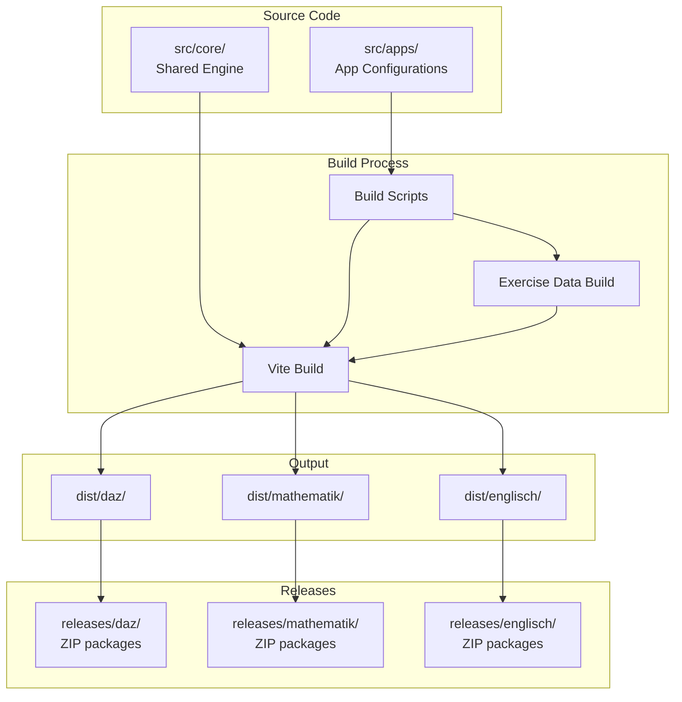
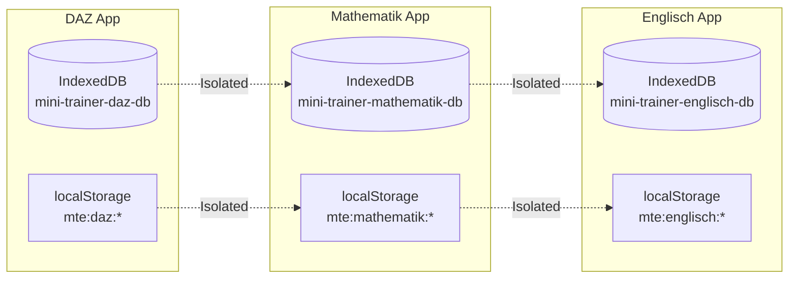

# Multi-App Architecture Design

## Overview

This document describes the architecture for supporting multiple independent applications (daz, mathematik, englisch, etc.) from a single Mini Trainer Engine codebase. Each app will have isolated configuration, exercise data, and save states while sharing the same core engine code.

## Design Goals

1. **Complete Isolation**: Each app's data, configuration, and save states must be completely isolated
2. **Single Codebase**: Core engine code remains shared across all apps
3. **Independent Builds**: Each app can be built and released independently
4. **Backward Compatibility**: Existing DAZ exercises and user data must remain functional
5. **Simple Developer Experience**: Building a new app should require minimal setup

---

## 1. Directory Structure

### Proposed Layout

```
mini-trainer-engine/
├── src/
│   ├── core/                          # CORE ENGINE (shared across all apps)
│   │   ├── components/
│   │   ├── hooks/
│   │   ├── stores/
│   │   ├── storage/
│   │   ├── utils/
│   │   ├── config/
│   │   │   ├── loader.ts              # Dynamic app-aware config loader
│   │   │   ├── ConfigContext.tsx      # App-aware config provider
│   │   │   ├── validation.ts
│   │   │   └── index.ts
│   │   └── ...
│   │
│   ├── apps/                          # APP-SPECIFIC CONFIGURATION
│   │   ├── daz/
│   │   │   ├── app.json               # App identity and metadata
│   │   │   ├── subject.json           # Subject configuration
│   │   │   ├── areas.json             # Observation areas
│   │   │   ├── themes.json            # Content themes
│   │   │   ├── badges.json            # Badge definitions
│   │   │   ├── exercises.json         # Exercise content
│   │   │   ├── assets/                # App-specific assets
│   │   │   │   ├── icon.svg
│   │   │   │   └── images/
│   │   │   └── i18n/                  # App-specific translations
│   │   │       ├── de.json
│   │   │       └── en.json
│   │   │
│   │   ├── mathematik/
│   │   │   ├── app.json
│   │   │   ├── subject.json
│   │   │   ├── areas.json
│   │   │   ├── themes.json
│   │   │   ├── badges.json
│   │   │   ├── exercises.json
│   │   │   ├── assets/
│   │   │   └── i18n/
│   │   │
│   │   └── englisch/
│   │       ├── app.json
│   │       └── ...
│   │
│   ├── types/                         # Shared type definitions
│   ├── App.tsx                        # App entry point (app-aware)
│   ├── main.tsx
│   └── index.css
│
├── public/
│   └── data/                          # Generated exercise data (build output)
│       ├── daz/
│       │   └── exercises.js
│       ├── mathematik/
│       │   └── exercises.js
│       └── englisch/
│           └── exercises.js
│
├── dist/                              # Build output
│   ├── daz/                           # DAZ app build
│   ├── mathematik/                    # Mathematik app build
│   └── englisch/                      # Englisch app build
│
├── releases/                          # Release packages
│   ├── daz/
│   │   ├── mini-trainer-daz-1.0.0.zip
│   │   └── mini-trainer-daz-1.0.0-pwa.zip
│   └── mathematik/
│       └── ...
│
├── scripts/
│   ├── build-app.mjs                  # Build single app
│   ├── build-all-apps.mjs             # Build all apps
│   ├── build-exercise-data.mjs        # Exercise data builder (app-aware)
│   ├── package-release.mjs            # Create release ZIP
│   └── validate-config.mjs            # Config validation (app-aware)
│
├── app.config.json                    # Build-time app selection
├── vite.config.ts                     # Vite config (app-aware)
└── package.json
```

### Directory Responsibilities

| Directory | Responsibility | Customization Level |
|-----------|---------------|---------------------|
| `src/core/` | Engine logic, components, hooks, stores | Never modified per app |
| `src/apps/{app}/` | App-specific configuration and data | Fully customizable |
| `public/data/{app}/` | Generated exercise data per app | Generated from config |
| `dist/{app}/` | Build output per app | Generated |
| `releases/{app}/` | Release packages | Generated |

---

## 2. Configuration System

### 2.1 App Identity Configuration

Each app requires an `app.json` file that defines its identity:

```json
// src/apps/daz/app.json
{
  "id": "daz",
  "name": "DaZ Trainer",
  "fullName": "Deutsch als Zweitsprache Trainer",
  "version": "1.0.0",
  "description": "German as a Second Language learning trainer",
  "author": "Your Organization",
  "license": "MIT",
  "repository": "https://github.com/org/mini-trainer-engine",
  "keywords": ["daz", "german", "language-learning", "education"],
  "buildConfig": {
    "baseHref": "/daz/",
    "pwaEnabled": true,
    "usbDistribution": true
  },
  "display": {
    "primaryColor": "#3B82F6",
    "icon": "assets/icon.svg",
    "splashBackground": "#1E40AF"
  }
}
```

### 2.2 App Configuration Types

```typescript
// src/types/app.ts

/**
 * App identity and metadata configuration.
 */
export interface AppConfig {
  /** Unique app identifier (used for storage isolation) */
  id: string;
  /** Short display name */
  name: string;
  /** Full display name */
  fullName: string;
  /** Semantic version string */
  version: string;
  /** App description */
  description: string;
  /** Author/organization */
  author: string;
  /** License identifier */
  license: string;
  /** Repository URL */
  repository?: string;
  /** Keywords for categorization */
  keywords: string[];
  /** Build configuration */
  buildConfig: AppBuildConfig;
  /** Display configuration */
  display: AppDisplayConfig;
}

export interface AppBuildConfig {
  /** Base href for deployment */
  baseHref: string;
  /** Enable PWA build */
  pwaEnabled: boolean;
  /** Enable USB distribution package */
  usbDistribution: boolean;
}

export interface AppDisplayConfig {
  /** Primary brand color */
  primaryColor: string;
  /** Path to app icon (relative to app directory) */
  icon: string;
  /** Splash screen background color */
  splashBackground: string;
}
```

### 2.3 Configuration Loading Strategy

The configuration loader will be modified to support app-aware loading:

```typescript
// src/core/config/loader.ts (conceptual changes)

/**
 * Get the current app ID from build-time configuration.
 * This is injected at build time via Vite define.
 */
const CURRENT_APP_ID = import.meta.env.VITE_APP_ID;

/**
 * Dynamic import path for app configuration.
 */
const APP_CONFIG_PATH = `/src/apps/${CURRENT_APP_ID}`;

/**
 * Load app configuration.
 */
export async function loadAppConfig(): Promise<AppConfig> {
  const config = await import(`${APP_CONFIG_PATH}/app.json`);
  return config.default;
}

/**
 * Load subject configuration for current app.
 */
export async function loadSubjectConfig(): Promise<SubjectConfig> {
  const config = await import(`${APP_CONFIG_PATH}/subject.json`);
  return validateSubjectConfig(config.default);
}

/**
 * Load observation areas for current app.
 */
export async function loadAreas(): Promise<ObservationArea[]> {
  const config = await import(`${APP_CONFIG_PATH}/areas.json`);
  return validateAreas(config.default);
}

// Similar pattern for themes, badges, exercises...
```

### 2.4 Build-Time vs Runtime Configuration

| Configuration | Loading Time | Reason |
|--------------|--------------|--------|
| App identity (`app.json`) | Build-time | Determines build output, storage keys |
| Subject config | Runtime | May need to display config in UI |
| Areas/Themes/Badges | Runtime | Used throughout the app |
| Exercise data | Runtime | Loaded from generated JS file |

### 2.5 Environment Variable Injection

```typescript
// vite.config.ts (conceptual)

export default defineConfig(({ mode }) => {
  // Read app ID from environment or config file
  const appId = process.env.VITE_APP_ID || 'daz';
  
  return {
    define: {
      'import.meta.env.VITE_APP_ID': JSON.stringify(appId),
    },
    // ... rest of config
  };
});
```

---

## 3. Exercise Data Storage

### 3.1 Directory Structure for Exercise Data

```
src/apps/
├── daz/
│   └── exercises.json          # DAZ exercises (existing)
│
├── mathematik/
│   └── exercises.json          # Mathematik exercises
│
└── englisch/
    └── exercises.json          # Englisch exercises

public/data/
├── daz/
│   └── exercises.js            # Generated DAZ bundle
│
├── mathematik/
│   └── exercises.js            # Generated Mathematik bundle
│
└── englisch/
    └── exercises.js            # Generated Englisch bundle
```

### 3.2 Exercise Data Build Process

The build script will be modified to accept an app ID parameter:

```bash
# Build exercise data for specific app
node scripts/build-exercise-data.mjs --app daz

# Build exercise data for all apps
node scripts/build-exercise-data.mjs --all
```

### 3.3 Exercise Data Loading

```typescript
// src/core/data/exerciseLoader.ts

/**
 * Load exercises for the current app.
 * Uses the generated exercises.js file.
 */
export async function loadExercises(): Promise<Exercise[]> {
  const appId = import.meta.env.VITE_APP_ID;
  
  // The exercises.js file sets window.__EXERCISE_DATA__
  // This is loaded via script tag in index.html
  const data = (window as any).__EXERCISE_DATA__;
  
  if (!data) {
    console.error(`Exercise data not loaded for app: ${appId}`);
    return [];
  }
  
  return data.exercises || [];
}
```

### 3.4 Preventing Cross-App Data Contamination

**Key Safeguards:**

1. **Separate directories**: Each app's exercises are in isolated directories
2. **Build-time validation**: Build script verifies app ID matches expected format
3. **Runtime verification**: App ID is embedded in generated exercise data

```typescript
// Generated exercises.js includes app verification
window.__EXERCISE_DATA__ = {
  appId: 'daz',  // Embedded app ID
  version: '1.0.0',
  exercises: [...]
};

// Runtime verification
if (data.appId !== import.meta.env.VITE_APP_ID) {
  console.error('Exercise data app mismatch!');
  throw new Error('Exercise data loaded for wrong app');
}
```

---

## 4. Save State Isolation

### 4.1 IndexedDB Database Naming

**Current Implementation:**

```typescript
// src/core/storage/db.ts (current)
const DB_NAME = 'mini-trainer-db';
```

**Proposed Implementation:**

```typescript
// src/core/storage/db.ts (proposed)

/**
 * Get the database name for the current app.
 * Format: mini-trainer-{appId}-db
 */
function getDbName(): string {
  const appId = import.meta.env.VITE_APP_ID;
  return `mini-trainer-${appId}-db`;
}

/**
 * Get or create the database connection.
 */
function getDB(): Promise<IDBPDatabase<TrainerDB>> {
  const dbName = getDbName();
  // ... rest of implementation
}
```

**Database Names by App:**

| App | Database Name |
|-----|---------------|
| daz | `mini-trainer-daz-db` |
| mathematik | `mini-trainer-mathematik-db` |
| englisch | `mini-trainer-englisch-db` |

### 4.2 localStorage Key Namespacing

**Current Implementation:**

```typescript
// src/core/storage/localStorage.ts (current)
const KEY_PREFIX = 'mte:';
```

**Proposed Implementation:**

```typescript
// src/core/storage/localStorage.ts (proposed)

/**
 * Get the storage key prefix for the current app.
 * Format: mte:{appId}:
 */
function getKeyPrefix(): string {
  const appId = import.meta.env.VITE_APP_ID;
  return `mte:${appId}:`;
}

/**
 * Get a namespaced storage key.
 */
function getNamespacedKey(key: string): string {
  return `${getKeyPrefix()}${key}`;
}
```

**Storage Keys by App:**

| App | Key Prefix | Example Key |
|-----|------------|-------------|
| daz | `mte:daz:` | `mte:daz:app:locale` |
| mathematik | `mte:mathematik:` | `mte:mathematik:app:locale` |
| englisch | `mte:englisch:` | `mte:englisch:app:locale` |

### 4.3 Verification of Isolation

**Test Cases Required:**

1. **Database Isolation Test:**

   ```typescript
   test('IndexedDB databases are isolated per app', async () => {
     // Create profile in DAZ app
     process.env.VITE_APP_ID = 'daz';
     await saveProfile({ id: 'test-1', nickname: 'DAZ User' });
     
     // Switch to Mathematik app
     process.env.VITE_APP_ID = 'mathematik';
     const profiles = await getAllProfiles();
     
     // Should not see DAZ profile
     expect(profiles).toHaveLength(0);
   });
   ```

2. **localStorage Isolation Test:**

   ```typescript
   test('localStorage keys are isolated per app', () => {
     // Set value in DAZ app
     process.env.VITE_APP_ID = 'daz';
     setCurrentProfileId('daz-profile-1');
     
     // Switch to Mathematik app
     process.env.VITE_APP_ID = 'mathematik';
     const profileId = getCurrentProfileId();
     
     // Should not see DAZ profile ID
     expect(profileId).toBeUndefined();
   });
   ```

### 4.4 Migration Path for Existing Users

For backward compatibility with existing DAZ users:

```typescript
// src/core/storage/migration.ts

/**
 * Migrate existing data from old storage keys to new namespaced keys.
 * Only runs once when upgrading from single-app to multi-app architecture.
 */
export async function migrateToMultiApp(): Promise<void> {
  const appId = import.meta.env.VITE_APP_ID;
  const migrationKey = `mte:${appId}:migration-complete`;
  
  // Check if already migrated
  if (localStorage.getItem(migrationKey)) {
    return;
  }
  
  // For DAZ app, migrate from old keys
  if (appId === 'daz') {
    await migrateDazData();
  }
  
  // Mark migration complete
  localStorage.setItem(migrationKey, new Date().toISOString());
}

/**
 * Migrate DAZ data from old storage format.
 */
async function migrateDazData(): Promise<void> {
  // Migrate IndexedDB data
  const oldDbName = 'mini-trainer-db';
  const newDbName = 'mini-trainer-daz-db';
  
  // Check if old database exists
  const databases = await indexedDB.databases();
  if (databases.some(db => db.name === oldDbName)) {
    // Copy data from old to new database
    // Then delete old database
    // Implementation details...
  }
  
  // Migrate localStorage keys
  const oldPrefix = 'mte:';
  const newPrefix = 'mte:daz:';
  
  for (let i = 0; i < localStorage.length; i++) {
    const key = localStorage.key(i);
    if (key?.startsWith(oldPrefix) && !key.startsWith(newPrefix)) {
      const value = localStorage.getItem(key);
      const newKey = key.replace(oldPrefix, newPrefix);
      localStorage.setItem(newKey, value!);
      localStorage.removeItem(key);
    }
  }
}
```

---

## 5. Build System

### 5.1 Vite Configuration

```typescript
// vite.config.ts (proposed)

import { defineConfig, type Plugin } from 'vite';
import react from '@vitejs/plugin-react';
import { fileURLToPath, URL } from 'node:url';
import { readFileSync } from 'fs';
import { join } from 'path';

/**
 * Get the current app configuration.
 */
function getAppConfig(appId: string) {
  const configPath = join(process.cwd(), 'src', 'apps', appId, 'app.json');
  return JSON.parse(readFileSync(configPath, 'utf-8'));
}

/**
 * Vite plugin for file:// protocol compatibility.
 */
function fileProtocolPlugin(): Plugin {
  // ... existing implementation
}

/**
 * Vite plugin for app-specific configuration.
 */
function appConfigPlugin(appId: string): Plugin {
  return {
    name: 'app-config',
    config() {
      const appConfig = getAppConfig(appId);
      
      return {
        define: {
          'import.meta.env.VITE_APP_ID': JSON.stringify(appId),
          'import.meta.env.VITE_APP_NAME': JSON.stringify(appConfig.name),
          'import.meta.env.VITE_APP_VERSION': JSON.stringify(appConfig.version),
        },
        base: appConfig.buildConfig.baseHref,
      };
    },
  };
}

export default defineConfig(({ mode }) => {
  // Get app ID from environment variable
  const appId = process.env.VITE_APP_ID || 'daz';
  
  return {
    plugins: [
      react(),
      fileProtocolPlugin(),
      appConfigPlugin(appId),
    ],
    resolve: {
      alias: {
        '@': fileURLToPath(new URL('./src', import.meta.url)),
        '@core': fileURLToPath(new URL('./src/core', import.meta.url)),
        '@types': fileURLToPath(new URL('./src/types', import.meta.url)),
      },
    },
    build: {
      target: 'esnext',
      outDir: `dist/${appId}`,
      rollupOptions: {
        output: {
          format: 'iife',
          inlineDynamicImports: true,
        },
      },
    },
  };
});
```

### 5.2 Build Scripts

#### Single App Build

```bash
# scripts/build-app.mjs

#!/usr/bin/env node

/**
 * Build a single app.
 * 
 * Usage:
 *   node scripts/build-app.mjs --app daz
 *   node scripts/build-app.mjs --app mathematik --pwa
 */

import { execSync } from 'child_process';
import { parseArgs } from 'util';

const { values } = parseArgs({
  options: {
    app: { type: 'string', short: 'a' },
    pwa: { type: 'boolean', default: false },
    'skip-data': { type: 'boolean', default: false },
  },
});

const appId = values.app;

if (!appId) {
  console.error('Error: --app option is required');
  process.exit(1);
}

console.log(`Building app: ${appId}`);

// Step 1: Build exercise data
if (!values['skip-data']) {
  console.log('Building exercise data...');
  execSync(`node scripts/build-exercise-data.mjs --app ${appId}`, { stdio: 'inherit' });
}

// Step 2: TypeScript compilation
console.log('Compiling TypeScript...');
execSync('tsc -b', { stdio: 'inherit' });

// Step 3: Vite build
console.log('Building with Vite...');
const buildCmd = values.pwa 
  ? `VITE_APP_ID=${appId} vite build && node scripts/generate-sw.mjs --app ${appId}`
  : `VITE_APP_ID=${appId} vite build`;
execSync(buildCmd, { stdio: 'inherit' });

console.log(`✅ Build complete: dist/${appId}/`);
```

#### Build All Apps

```bash
# scripts/build-all-apps.mjs

#!/usr/bin/env node

/**
 * Build all configured apps.
 * 
 * Usage:
 *   node scripts/build-all-apps.mjs
 *   node scripts/build-all-apps.mjs --pwa
 */

import { readdirSync, existsSync } from 'fs';
import { join } from 'path';
import { execSync } from 'child_process';

const appsDir = join(process.cwd(), 'src', 'apps');
const apps = readdirSync(appsDir, { withFileTypes: true })
  .filter(dirent => dirent.isDirectory())
  .map(dirent => dirent.name);

console.log(`Found ${apps.length} apps: ${apps.join(', ')}`);

for (const appId of apps) {
  console.log(`\n${'='.repeat(50)}`);
  console.log(`Building: ${appId}`);
  console.log('='.repeat(50));
  
  execSync(`node scripts/build-app.mjs --app ${appId}`, { stdio: 'inherit' });
}

console.log('\n✅ All apps built successfully');
```

### 5.3 Package.json Scripts

```json
{
  "scripts": {
    "dev": "VITE_APP_ID=daz vite",
    "dev:mathematik": "VITE_APP_ID=mathematik vite",
    "dev:englisch": "VITE_APP_ID=englisch vite",
    
    "build": "node scripts/build-app.mjs --app daz",
    "build:daz": "node scripts/build-app.mjs --app daz",
    "build:mathematik": "node scripts/build-app.mjs --app mathematik",
    "build:englisch": "node scripts/build-app.mjs --app englisch",
    "build:all": "node scripts/build-all-apps.mjs",
    
    "build:pwa": "node scripts/build-app.mjs --app daz --pwa",
    "build:pwa:daz": "node scripts/build-app.mjs --app daz --pwa",
    "build:pwa:all": "node scripts/build-all-apps.mjs --pwa",
    
    "package": "node scripts/package-release.mjs --app daz",
    "package:all": "node scripts/package-release.mjs --all",
    
    "validate": "node scripts/validate-config.mjs --app daz",
    "validate:all": "node scripts/validate-config.mjs --all"
  }
}
```

---

## 6. Release Process

### 6.1 Release Package Structure

```
releases/
├── daz/
│   ├── mini-trainer-daz-1.0.0.zip          # USB distribution
│   ├── mini-trainer-daz-1.0.0-pwa.zip      # PWA package
│   └── latest/                              # Symlink to latest version
│
└── mathematik/
    ├── mini-trainer-mathematik-1.0.0.zip
    ├── mini-trainer-mathematik-1.0.0-pwa.zip
    └── latest/
```

### 6.2 USB Distribution Package

The USB distribution package is designed for offline use:

```
mini-trainer-daz-1.0.0.zip
├── index.html
├── assets/
│   ├── index-[hash].js
│   └── index-[hash].css
├── data/
│   └── exercises.js
├── fonts/
├── icon.svg
└── README.txt
```

**Key Features:**

- No external dependencies
- Works with file:// protocol
- All assets use relative paths
- No service worker (not needed for local files)

### 6.3 PWA Package

The PWA package is for web server deployment:

```
mini-trainer-daz-1.0.0-pwa.zip
├── index.html
├── manifest.json
├── sw.js
├── assets/
│   ├── index-[hash].js
│   └── index-[hash].css
├── data/
│   └── exercises.js
├── fonts/
├── icons/
│   ├── icon-192.png
│   ├── icon-512.png
│   └── icon-maskable.png
└── README.txt
```

**Key Features:**

- Service worker for offline support
- Web app manifest for installation
- Absolute paths configured for deployment URL
- Cache-busted asset names

### 6.4 Manifest Generation

Each app gets its own manifest with app-specific values:

```json
// public/manifest.json (template)
{
  "name": "{{APP_NAME}}",
  "short_name": "{{APP_SHORT_NAME}}",
  "description": "{{APP_DESCRIPTION}}",
  "start_url": "{{BASE_HREF}}",
  "display": "standalone",
  "background_color": "{{SPLASH_BACKGROUND}}",
  "theme_color": "{{PRIMARY_COLOR}}",
  "icons": [
    {
      "src": "icons/icon-192.png",
      "sizes": "192x192",
      "type": "image/png"
    },
    {
      "src": "icons/icon-512.png",
      "sizes": "512x512",
      "type": "image/png"
    },
    {
      "src": "icons/icon-maskable.png",
      "sizes": "512x512",
      "type": "image/png",
      "purpose": "maskable"
    }
  ]
}
```

### 6.5 Release Script

```bash
# scripts/package-release.mjs

#!/usr/bin/env node

/**
 * Package a release for distribution.
 * 
 * Usage:
 *   node scripts/package-release.mjs --app daz
 *   node scripts/package-release.mjs --all
 */

import { createWriteStream, readdirSync, statSync, readFileSync } from 'fs';
import { join, basename } from 'path';
import archiver from 'archiver';
import { parseArgs } from 'util';

const { values } = parseArgs({
  options: {
    app: { type: 'string', short: 'a' },
    all: { type: 'boolean', default: false },
    type: { type: 'string', default: 'both' }, // 'usb', 'pwa', 'both'
  },
});

async function createZip(sourceDir: string, outputPath: string): Promise<void> {
  return new Promise((resolve, reject) => {
    const output = createWriteStream(outputPath);
    const archive = archiver('zip', { zlib: { level: 9 } });
    
    output.on('close', () => resolve());
    archive.on('error', reject);
    
    archive.pipe(output);
    archive.directory(sourceDir, false);
    archive.finalize();
  });
}

async function packageApp(appId: string): Promise<void> {
  const appConfig = JSON.parse(
    readFileSync(join(process.cwd(), 'src', 'apps', appId, 'app.json'), 'utf-8')
  );
  
  const version = appConfig.version;
  const distDir = join(process.cwd(), 'dist', appId);
  const releasesDir = join(process.cwd(), 'releases', appId);
  
  // Create releases directory
  // ... directory creation code
  
  // Package USB distribution
  if (appConfig.buildConfig.usbDistribution && values.type !== 'pwa') {
    const usbPath = join(releasesDir, `mini-trainer-${appId}-${version}.zip`);
    console.log(`Creating USB package: ${usbPath}`);
    await createZip(distDir, usbPath);
  }
  
  // Package PWA
  if (appConfig.buildConfig.pwaEnabled && values.type !== 'usb') {
    const pwaPath = join(releasesDir, `mini-trainer-${appId}-${version}-pwa.zip`);
    console.log(`Creating PWA package: ${pwaPath}`);
    await createZip(distDir, pwaPath);
  }
  
  console.log(`✅ Packaged: ${appId} v${version}`);
}

// Main execution
if (values.all) {
  const appsDir = join(process.cwd(), 'src', 'apps');
  const apps = readdirSync(appsDir, { withFileTypes: true })
    .filter(dirent => dirent.isDirectory())
    .map(dirent => dirent.name);
  
  for (const appId of apps) {
    await packageApp(appId);
  }
} else if (values.app) {
  await packageApp(values.app);
} else {
  console.error('Error: --app or --all option required');
  process.exit(1);
}
```

### 6.6 Version Management

Each app manages its own version independently:

```json
// src/apps/daz/app.json
{
  "id": "daz",
  "version": "1.2.0",
  ...
}

// src/apps/mathematik/app.json
{
  "id": "mathematik",
  "version": "0.5.0",
  ...
}
```

**Version Bump Script:**

```bash
# Bump version for specific app
node scripts/bump-version.mjs --app daz --type minor

# Types: major, minor, patch
```

---

## 7. Implementation Checklist

### Phase 1: Core Infrastructure

- [ ] Create `src/apps/` directory structure
- [ ] Move existing DAZ config to `src/apps/daz/`
- [ ] Create `app.json` type definitions
- [ ] Update config loader for app-aware loading
- [ ] Update storage modules for app namespacing
- [ ] Add migration logic for existing DAZ users

### Phase 2: Build System

- [ ] Update `vite.config.ts` for app-aware builds
- [ ] Create `build-app.mjs` script
- [ ] Create `build-all-apps.mjs` script
- [ ] Update `build-exercise-data.mjs` for app parameter
- [ ] Update `validate-config.mjs` for app parameter
- [ ] Update `package.json` scripts

### Phase 3: Release Process

- [ ] Create `package-release.mjs` script
- [ ] Create manifest generation script
- [ ] Create icon generation script
- [ ] Test USB distribution package
- [ ] Test PWA package

### Phase 4: Testing & Documentation

- [ ] Add tests for storage isolation
- [ ] Add tests for config loading
- [ ] Add tests for build scripts
- [ ] Update documentation
- [ ] Create app creation guide

---

## 8. Creating a New App

### Step-by-Step Guide

1. **Create app directory:**

   ```bash
   mkdir -p src/apps/mathematik
   ```

2. **Create app.json:**

   ```json
   {
     "id": "mathematik",
     "name": "Mathematik Trainer",
     "fullName": "Mathematik Lerntrainer",
     "version": "1.0.0",
     "description": "Mathematics learning trainer",
     "author": "Your Organization",
     "license": "MIT",
     "keywords": ["math", "mathematics", "education"],
     "buildConfig": {
       "baseHref": "/mathematik/",
       "pwaEnabled": true,
       "usbDistribution": true
     },
     "display": {
       "primaryColor": "#10B981",
       "icon": "assets/icon.svg",
       "splashBackground": "#059669"
     }
   }
   ```

3. **Create configuration files:**
   - `subject.json` - Subject configuration
   - `areas.json` - Observation areas
   - `themes.json` - Content themes
   - `badges.json` - Badge definitions

4. **Add exercise content:**
   - `exercises.json` - Exercise data

5. **Add assets (optional):**
   - `assets/icon.svg` - App icon
   - `assets/images/` - Additional images

6. **Add translations (optional):**
   - `i18n/de.json` - German translations
   - `i18n/en.json` - English translations

7. **Build the app:**

   ```bash
   npm run build:mathematik
   ```

8. **Package for release:**

   ```bash
   npm run package -- --app mathematik
   ```

---

## 9. Architecture Diagram



---

## 10. Storage Isolation Diagram



---

## 11. Summary

This architecture provides:

1. **Complete Isolation**: Each app has separate IndexedDB databases and namespaced localStorage keys
2. **Shared Core**: All apps use the same engine code from `src/core/`
3. **Independent Builds**: Each app can be built and versioned independently
4. **Flexible Deployment**: Support for both USB distribution and PWA deployment
5. **Backward Compatibility**: Migration path for existing DAZ users
6. **Simple Developer Experience**: Creating a new app requires only creating a directory with configuration files

The key changes from the current architecture are:

1. Move app-specific config from `src/config/` to `src/apps/{app}/`
2. Add `app.json` for app identity and metadata
3. Update config loader to be app-aware
4. Update storage modules to use app-specific namespaces
5. Update build scripts to support multiple apps
6. Add release packaging scripts
