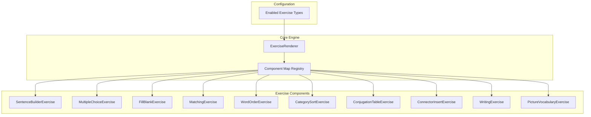
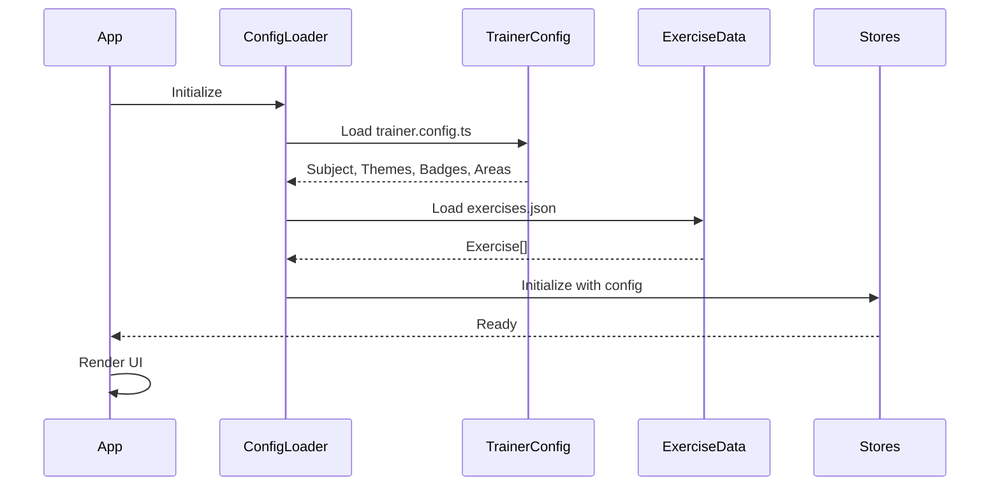
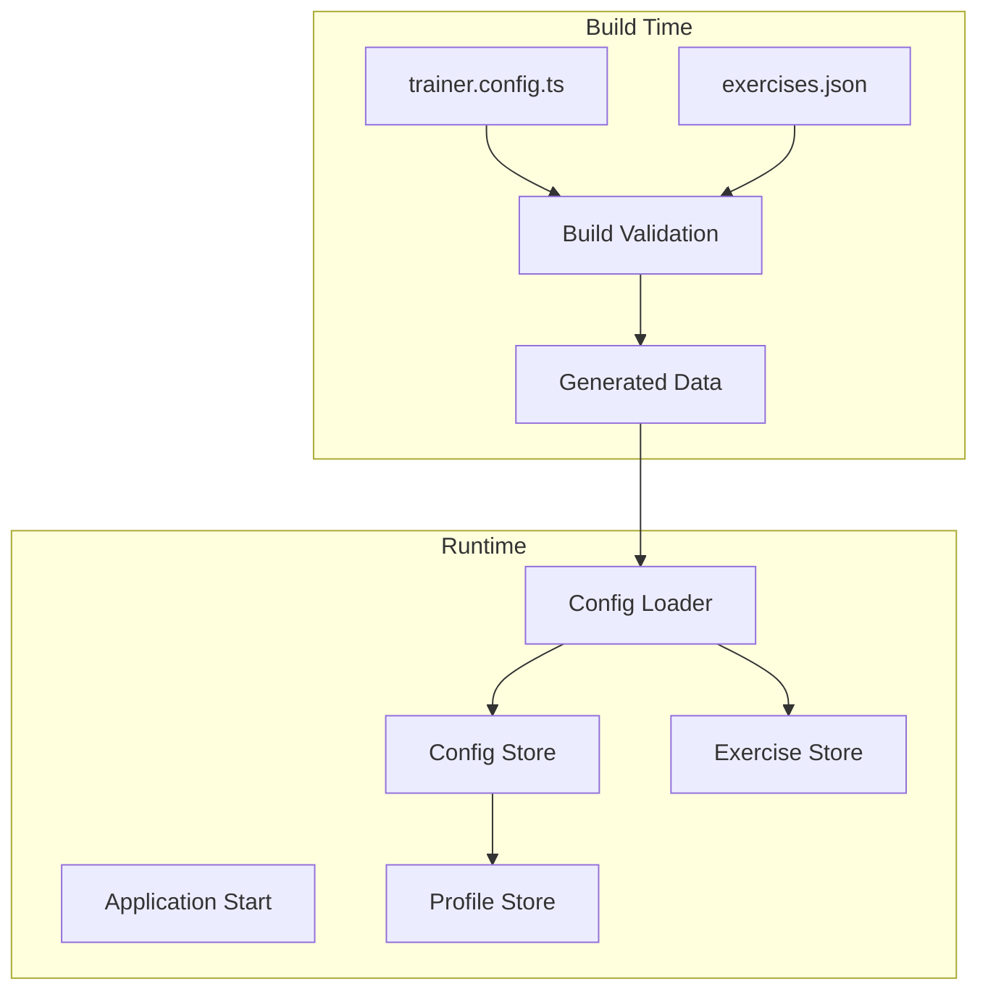
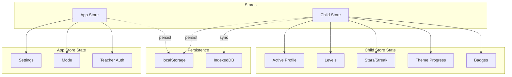
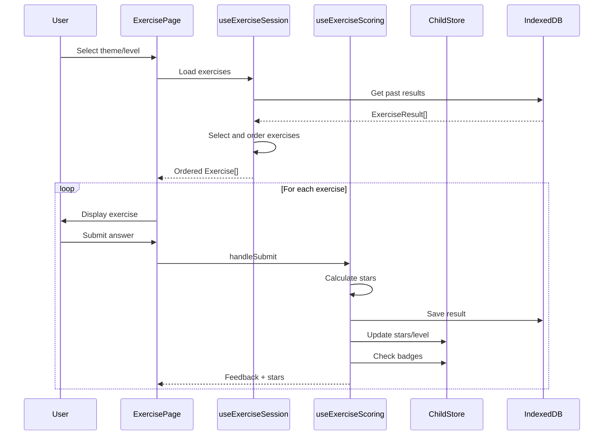
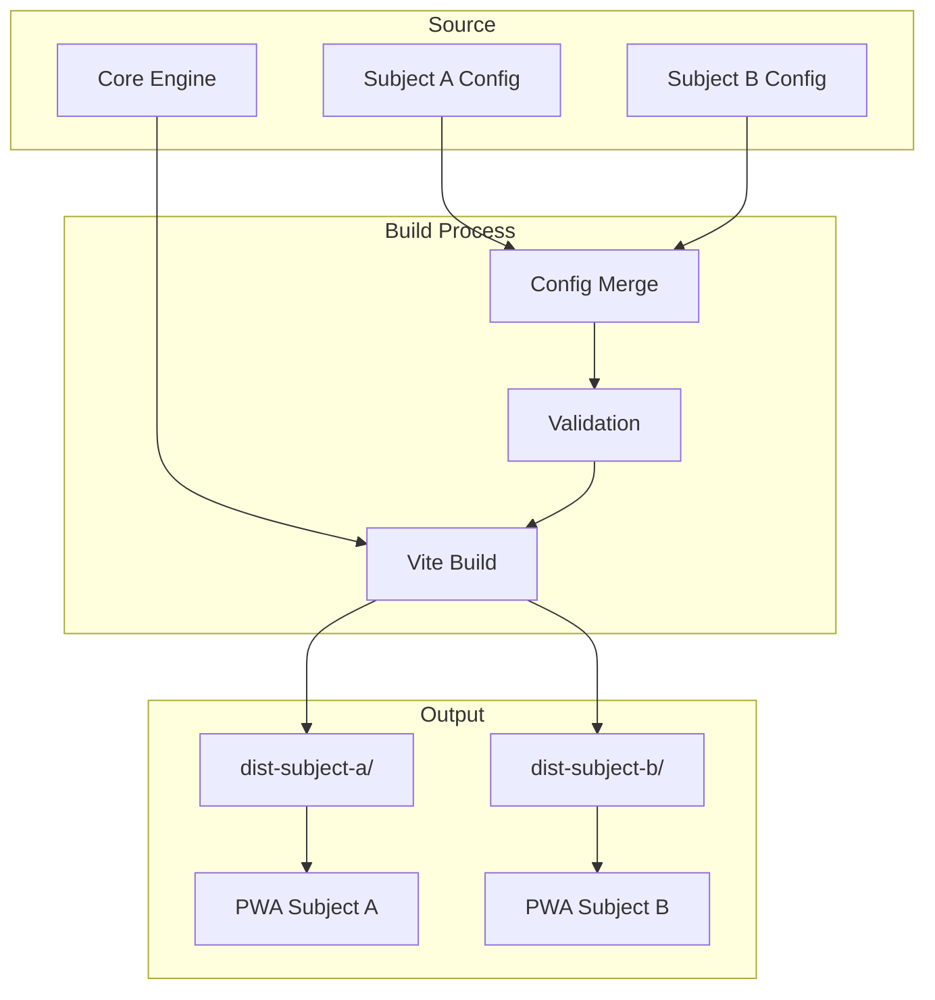

# Mini Trainer Engine - Architecture Document

## Overview

Mini Trainer Engine is a reusable, configurable trainer application shell that can be customized for any subject. It provides a complete learning platform with exercise types, gamification, diagnostic frameworks, and accessibility features.

The architecture separates **core engine code** (unchanged between trainers) from **configuration files** (customizable per trainer), enabling rapid development of new subject-specific trainers without modifying the core codebase.

---

## 1. Project Structure

```
mini-trainer-engine/
├── src/
│   ├── core/                          # CORE ENGINE (unchanged between trainers)
│   │   ├── components/
│   │   │   ├── exercises/             # Exercise type components
│   │   │   │   ├── ExerciseRenderer.tsx
│   │   │   │   ├── SentenceBuilderExercise.tsx
│   │   │   │   ├── ConjugationTableExercise.tsx
│   │   │   │   ├── MultipleChoiceExercise.tsx
│   │   │   │   ├── FillBlankExercise.tsx
│   │   │   │   ├── MatchingExercise.tsx
│   │   │   │   ├── WordOrderExercise.tsx
│   │   │   │   ├── CategorySortExercise.tsx
│   │   │   │   ├── ConnectorInsertExercise.tsx
│   │   │   │   ├── WritingExercise.tsx
│   │   │   │   ├── PictureVocabularyExercise.tsx
│   │   │   │   └── HintButton.tsx
│   │   │   ├── BottomNav.tsx
│   │   │   ├── ErrorBoundary.tsx
│   │   │   ├── BadgeNotification.tsx
│   │   │   └── LevelUpCelebration.tsx
│   │   ├── hooks/
│   │   │   ├── useExerciseScoring.ts
│   │   │   ├── useExerciseSession.ts
│   │   │   └── useFocusTrap.ts
│   │   ├── stores/
│   │   │   ├── appStore.ts
│   │   │   └── childStore.ts
│   │   ├── storage/
│   │   │   └── db.ts
│   │   ├── utils/
│   │   │   ├── dailyChallenge.ts
│   │   │   ├── dataExport.ts
│   │   │   ├── exerciseSelector.ts
│   │   │   ├── levelThresholds.ts
│   │   │   └── sounds.ts
│   │   ├── pages/
│   │   │   ├── HomePage.tsx
│   │   │   ├── ThemeSelectPage.tsx
│   │   │   ├── LevelSelectPage.tsx
│   │   │   ├── ExercisePage.tsx
│   │   │   ├── ProgressPage.tsx
│   │   │   ├── SettingsPage.tsx
│   │   │   ├── TeacherPinPage.tsx
│   │   │   ├── TeacherDashboardPage.tsx
│   │   │   ├── BadgeGalleryPage.tsx
│   │   │   └── DailyChallengePage.tsx
│   │   └── i18n/
│   │       └── index.ts
│   │
│   ├── config/                        # CONFIGURATION (customizable per trainer)
│   │   ├── trainer.config.ts          # Main trainer configuration
│   │   ├── subject.config.ts          # Subject/domain definition
│   │   ├── exercises.json             # Exercise content data
│   │   ├── themes.json                # Content themes
│   │   ├── badges.json                # Achievement definitions
│   │   ├── observationAreas.json      # Diagnostic framework
│   │   └── i18n/
│   │       ├── de-AT.json
│   │       ├── en.json
│   │       └── [other-locales].json
│   │
│   ├── types/                         # TYPE DEFINITIONS (extensible)
│   │   ├── index.ts
│   │   ├── exercises.ts
│   │   ├── observations.ts
│   │   ├── themes.ts
│   │   ├── profile.ts
│   │   ├── settings.ts
│   │   └── config.ts                  # Configuration type definitions
│   │
│   ├── App.tsx
│   ├── main.tsx
│   └── index.css
│
├── public/
│   └── data/
│       └── exercises.js               # Generated exercise data (IIFE format)
│
├── scripts/
│   ├── build-exercise-data.mjs        # Exercise data build script
│   ├── validate-exercises.cjs         # Exercise validation script
│   └── add-new-exercises.mjs          # Exercise authoring helper
│
├── plans/                             # Architecture and planning documents
├── .kilocode/                         # Kilo Code configuration
├── vite.config.ts
├── tailwind.config.js
├── tsconfig.json
└── package.json
```

### Directory Responsibilities

| Directory | Responsibility | Customization Level |
|-----------|---------------|---------------------|
| `src/core/` | Engine logic, components, hooks, stores | Never modified |
| `src/config/` | Trainer-specific configuration | Fully customizable |
| `src/types/` | TypeScript type definitions | Extensible |
| `public/data/` | Generated exercise data | Generated from config |
| `scripts/` | Build and validation tools | Rarely modified |

---

## 2. Configuration Schema

### 2.1 Main Configuration Types

```typescript
// src/types/config.ts

import type { Exercise, ExerciseContent, ExerciseType } from './exercises';
import type { ObservationArea, ObservationAreaId } from './observations';
import type { Theme, ThemeId } from './themes';
import type { Badge, ChildProfile } from './profile';

/**
 * Main trainer configuration object.
 * This is the root configuration that defines the entire trainer.
 */
export interface TrainerConfig {
  /** Unique identifier for this trainer */
  id: string;
  /** Human-readable trainer name */
  name: string;
  /** Trainer description */
  description: string;
  /** Version string */
  version: string;
  /** Subject/domain configuration */
  subject: SubjectConfig;
  /** Available observation/diagnostic areas */
  observationAreas: ObservationArea[];
  /** Content themes */
  themes: Theme[];
  /** Badge definitions with check functions */
  badges: BadgeDefinition[];
  /** Supported locales */
  supportedLocales: SupportedLocale[];
  /** Default locale */
  defaultLocale: SupportedLocale;
  /** Gamification configuration */
  gamification: GamificationConfig;
  /** Accessibility defaults */
  accessibility: AccessibilityDefaults;
}

/**
 * Subject/domain definition.
 * Defines what subject this trainer teaches.
 */
export interface SubjectConfig {
  /** Subject identifier */
  id: string;
  /** Subject name (e.g., "German as a Second Language") */
  name: string;
  /** Subject description */
  description: string;
  /** Target audience description */
  targetAudience: string;
  /** Primary skill area for level progression */
  primarySkillArea: ObservationAreaId;
  /** Exercise types enabled for this subject */
  enabledExerciseTypes: ExerciseType[];
  /** Custom exercise type configurations */
  exerciseTypeConfig?: Partial<Record<ExerciseType, ExerciseTypeConfig>>;
}

/**
 * Exercise type-specific configuration
 */
export interface ExerciseTypeConfig {
  /** Whether hints are enabled for this type */
  hintsEnabled?: boolean;
  /** Maximum attempts allowed */
  maxAttempts?: number;
  /** Custom scoring rules */
  scoring?: ScoringRule[];
}

/**
 * Gamification configuration
 */
export interface GamificationConfig {
  /** Star calculation strategy */
  starStrategy: 'attempts' | 'time' | 'custom';
  /** Maximum stars per exercise */
  maxStarsPerExercise: number;
  /** Level progression thresholds */
  levelThresholds: LevelThreshold[];
  /** Streak configuration */
  streakConfig: StreakConfig;
}

export interface LevelThreshold {
  level: number;
  starsRequired: number;
}

export interface StreakConfig {
  /** Days required for each streak badge */
  milestones: number[];
}

/**
 * Accessibility default settings
 */
export interface AccessibilityDefaults {
  defaultFontSize: 'normal' | 'large' | 'extra-large';
  defaultHighContrast: boolean;
  defaultAnimationsEnabled: boolean;
  defaultSoundEnabled: boolean;
}

/**
 * Badge definition with check function
 */
export interface BadgeDefinition {
  badge: Omit<Badge, 'earnedAt'>;
  /** Function to check if badge is earned */
  check: (profile: ChildProfile) => boolean;
  /** Optional: condition expression for JSON serialization */
  checkExpression?: string;
}

export type SupportedLocale = string;
```

### 2.2 Exercise Type Definitions

```typescript
// src/types/exercises.ts

/**
 * All supported exercise types.
 * Each type has a corresponding content interface and component.
 */
export type ExerciseType =
  | 'fill-blank'
  | 'multiple-choice'
  | 'matching'
  | 'sentence-builder'
  | 'sorting'
  | 'writing'
  | 'conjugation-table'
  | 'connector-insert'
  | 'word-order'
  | 'picture-vocabulary';

/**
 * Discriminated union for exercise content.
 * The 'type' field determines which content shape is used.
 */
export type ExerciseContent =
  | SentenceBuilderContent
  | ConjugationTableContent
  | MultipleChoiceContent
  | FillBlankContent
  | MatchingContent
  | SortingContent
  | ConnectorInsertContent
  | WritingContent
  | WordOrderContent
  | PictureVocabularyContent;

export interface SentenceBuilderContent {
  type: 'sentence-builder';
  columns: {
    label: string;
    words: string[];
  }[];
  targetSentences: string[];
}

export interface ConjugationTableContent {
  type: 'conjugation-table';
  verb: string;
  tense: string;
  cells: {
    person: string;
    correctForm: string;
    prefilled: boolean;
  }[];
}

export interface MultipleChoiceContent {
  type: 'multiple-choice';
  question: string;
  options: string[];
  correctIndex: number;
}

export interface FillBlankContent {
  type: 'fill-blank';
  sentence: string; // contains {{blank}} placeholder
  correctAnswer: string;
  acceptableAnswers: string[];
  numericWordForm?: string;
}

export interface MatchingContent {
  type: 'matching';
  pairs: { left: string; right: string }[];
}

export interface SortingContent {
  type: 'sorting';
  categories: { label: string; items: string[] }[];
}

export interface WordOrderContent {
  type: 'word-order';
  correctOrder: string[];
  scrambled: string[];
}

export interface ConnectorInsertContent {
  type: 'connector-insert';
  sentencePart1: string;
  sentencePart2: string;
  correctConnector: string;
  options: string[];
}

export interface WritingContent {
  type: 'writing';
  prompt: string;
  scaffoldLevel: string;
  scaffoldHints: string[];
  starterWords: string[];
  minLength: number;
}

export interface PictureVocabularyContent {
  type: 'picture-vocabulary';
  picture: string; // Emoji or unicode symbol
  pictureAlt: string; // Accessible description
  correctAnswer: string;
  acceptableAnswers: string[];
  options: string[];
}

/**
 * Complete exercise definition
 */
export interface Exercise {
  id: string;
  type: ExerciseType;
  areaId: ObservationAreaId;
  themeId: ThemeId;
  level: number;
  difficulty: 1 | 2 | 3;
  instruction: string;
  content: ExerciseContent;
  hints: string[];
  feedbackCorrect: string;
  feedbackIncorrect: string;
}

/**
 * Recorded result of an exercise attempt
 */
export interface ExerciseResult {
  id: string;
  childProfileId: string;
  exerciseId: string;
  areaId: ObservationAreaId;
  themeId: ThemeId;
  level: number;
  correct: boolean;
  score: number; // 0-3 stars
  attempts: number;
  timeSpentSeconds: number;
  completedAt: string;
}
```

### 2.3 Observation Area Definitions

```typescript
// src/types/observations.ts

/**
 * Observation area identifier type.
 * Customized per trainer based on diagnostic framework.
 */
export type ObservationAreaId = string;

/**
 * Category for grouping observation areas.
 */
export type ObservationCategory = string;

/**
 * Developmental stage within an observation area.
 */
export interface ObservationStage {
  level: number;
  label: string;
  description: string;
  examples: string[];
}

/**
 * Complete observation area definition.
 * Used for diagnostic frameworks like USB-DaZ.
 */
export interface ObservationArea {
  id: ObservationAreaId;
  name: string;
  category: ObservationCategory;
  stages: ObservationStage[];
}

/**
 * Time point for observations (e.g., start/middle/end of year)
 */
export type TimePoint = 't1' | 't2' | 't3';

/**
 * Observation record for a student at a time point
 */
export interface ObservationRecord {
  id: string;
  studentId: string;
  timePoint: TimePoint;
  date: string;
  observations: AreaObservation[];
  notes: string;
  createdAt: string;
  updatedAt: string;
}

export interface AreaObservation {
  areaId: ObservationAreaId;
  achievedLevel: number;
  notes: string;
  strategyChecks?: Record<string, boolean>;
  orthographyRatings?: Record<string, 'nie' | 'selten' | 'oft' | 'immer'>;
  textTypeRatings?: Record<string, number>;
  productiveLevel?: number;
  receptiveLevel?: number;
}
```

### 2.4 Theme Definitions

```typescript
// src/types/themes.ts

/**
 * Theme identifier type.
 * Customized per trainer based on content.
 */
export type ThemeId = string;

/**
 * Content theme definition.
 * Themes group related exercises.
 */
export interface Theme {
  id: ThemeId;
  name: string;
  icon: string;
  color: string;
  description: string;
  minLevel: number;
}

/**
 * Progress tracking for a theme
 */
export interface ThemeProgress {
  unlocked: boolean;
  exercisesCompleted: number;
  exercisesTotal: number;
  starsEarned: number;
  maxStars: number;
}
```

### 2.5 Profile and Badge Definitions

```typescript
// src/types/profile.ts

import type { ObservationAreaId } from './observations';
import type { ThemeId, ThemeProgress } from './themes';

/**
 * Achievement badge
 */
export interface Badge {
  id: string;
  name: string;
  description: string;
  icon: string;
  earnedAt: string;
}

/**
 * Child/learner profile
 */
export interface ChildProfile {
  id: string;
  nickname: string;
  avatarId: string;
  createdAt: string;
  currentLevels: Record<ObservationAreaId, number>;
  totalStars: number;
  currentStreak: number;
  longestStreak: number;
  lastActiveDate: string;
  themeProgress: Record<ThemeId, ThemeProgress>;
  badges: Badge[];
}

/**
 * Student profile for teacher dashboard
 */
export interface StudentProfile {
  id: string;
  name: string;
  dateOfBirth?: string;
  className?: string;
  firstLanguages: string[];
  contactDurationMonths: number;
  status: 'ausserordentlich' | 'ordentlich';
  supportMeasure: string;
  notes: string;
  createdAt: string;
  updatedAt: string;
}

/**
 * Foerderplan (support plan) entry
 */
export interface FoerderplanEntry {
  areaId: ObservationAreaId;
  currentLevel: number;
  targetLevel: number;
  goalsConsolidate: string;
  goalsPrepare: string;
  activitiesIntegrative: string;
  activitiesParallel: string;
  documentation: string;
}

export interface Foerderplan {
  id: string;
  studentId: string;
  period: string;
  involvedTeachers: string[];
  entries: FoerderplanEntry[];
  createdAt: string;
  updatedAt: string;
}
```

---

## 3. Component Architecture

### 3.1 Exercise Component Registry Pattern

The engine uses a **component registry pattern** to map exercise types to their React components. This enables loose coupling between the engine and exercise implementations.



### 3.2 ExerciseRenderer Implementation

```typescript
// src/core/components/exercises/ExerciseRenderer.tsx

import { memo } from 'react';
import type { ExerciseContent } from '@/types';

interface ExerciseProps {
  content: ExerciseContent;
  hints: string[];
  onSubmit: (correct: boolean) => void;
  showSolution: boolean;
}

// Component registry - maps exercise types to components
const EXERCISE_COMPONENTS: Record<string, React.ComponentType<ExerciseProps>> = {
  'sentence-builder': SentenceBuilderExercise,
  'conjugation-table': ConjugationTableExercise,
  'multiple-choice': MultipleChoiceExercise,
  'fill-blank': FillBlankExercise,
  'matching': MatchingExercise,
  'word-order': WordOrderExercise,
  'sorting': CategorySortExercise,
  'connector-insert': ConnectorInsertExercise,
  'writing': WritingExercise,
  'picture-vocabulary': PictureVocabularyExercise,
};

export const ExerciseRenderer = memo(function ExerciseRenderer(
  { content, hints, onSubmit, showSolution }: ExerciseProps
) {
  const Component = EXERCISE_COMPONENTS[content.type];
  if (!Component) {
    console.error(`Unknown exercise type: ${content.type}`);
    return null;
  }
  return <Component content={content} hints={hints} onSubmit={onSubmit} showSolution={showSolution} />;
});
```

### 3.3 Configuration Loading Sequence



### 3.4 Configuration Validation

```typescript
// src/core/utils/configValidator.ts

import type { TrainerConfig, Exercise } from '@/types';

export interface ValidationResult {
  valid: boolean;
  errors: ValidationError[];
  warnings: ValidationWarning[];
}

export interface ValidationError {
  code: string;
  message: string;
  path: string;
}

export interface ValidationWarning {
  code: string;
  message: string;
  path: string;
}

export function validateTrainerConfig(config: TrainerConfig): ValidationResult {
  const errors: ValidationError[] = [];
  const warnings: ValidationWarning[] = [];
  
  // Validate required fields
  if (!config.id) errors.push({ code: 'MISSING_ID', message: 'Trainer ID is required', path: 'id' });
  if (!config.name) errors.push({ code: 'MISSING_NAME', message: 'Trainer name is required', path: 'name' });
  
  // Validate observation areas
  const areaIds = new Set(config.observationAreas.map(a => a.id));
  if (areaIds.size !== config.observationAreas.length) {
    errors.push({ code: 'DUPLICATE_AREA_ID', message: 'Duplicate observation area IDs', path: 'observationAreas' });
  }
  
  // Validate themes
  const themeIds = new Set(config.themes.map(t => t.id));
  if (themeIds.size !== config.themes.length) {
    errors.push({ code: 'DUPLICATE_THEME_ID', message: 'Duplicate theme IDs', path: 'themes' });
  }
  
  // Validate primary skill area exists
  if (!areaIds.has(config.subject.primarySkillArea)) {
    errors.push({ 
      code: 'INVALID_PRIMARY_SKILL', 
      message: `Primary skill area ${config.subject.primarySkillArea} not found in observation areas`,
      path: 'subject.primarySkillArea'
    });
  }
  
  return {
    valid: errors.length === 0,
    errors,
    warnings
  };
}

export function validateExercises(
  exercises: Exercise[], 
  config: TrainerConfig
): ValidationResult {
  const errors: ValidationError[] = [];
  const warnings: ValidationWarning[] = [];
  
  const validAreaIds = new Set(config.observationAreas.map(a => a.id));
  const validThemeIds = new Set(config.themes.map(t => t.id));
  const enabledTypes = new Set(config.subject.enabledExerciseTypes);
  
  for (const exercise of exercises) {
    // Validate area reference
    if (!validAreaIds.has(exercise.areaId)) {
      errors.push({
        code: 'INVALID_AREA_REF',
        message: `Exercise ${exercise.id} references unknown area ${exercise.areaId}`,
        path: `exercises.${exercise.id}.areaId`
      });
    }
    
    // Validate theme reference
    if (!validThemeIds.has(exercise.themeId)) {
      errors.push({
        code: 'INVALID_THEME_REF',
        message: `Exercise ${exercise.id} references unknown theme ${exercise.themeId}`,
        path: `exercises.${exercise.id}.themeId`
      });
    }
    
    // Validate exercise type is enabled
    if (!enabledTypes.has(exercise.type)) {
      warnings.push({
        code: 'DISABLED_EXERCISE_TYPE',
        message: `Exercise ${exercise.id} uses disabled type ${exercise.type}`,
        path: `exercises.${exercise.id}.type`
      });
    }
    
    // Validate content matches type
    if (exercise.content.type !== exercise.type) {
      errors.push({
        code: 'CONTENT_TYPE_MISMATCH',
        message: `Exercise ${exercise.id} has type ${exercise.type} but content type is ${exercise.content.type}`,
        path: `exercises.${exercise.id}.content`
      });
    }
  }
  
  return { valid: errors.length === 0, errors, warnings };
}
```

### 3.5 Gamification Logic Abstraction

```typescript
// src/core/utils/gamification.ts

import type { GamificationConfig, LevelThreshold } from '@/types';

/**
 * Abstract gamification calculator.
 * Can be customized via configuration.
 */
export interface GamificationCalculator {
  calculateStars(attempt: number, timeSpentSeconds?: number): number;
  calculateLevel(totalStars: number, thresholds: LevelThreshold[]): number;
  checkBadgeConditions(profile: ChildProfile): Badge[];
}

/**
 * Default implementation: stars based on attempts
 */
export function createDefaultCalculator(config: GamificationConfig): GamificationCalculator {
  return {
    calculateStars(attempt: number): number {
      if (config.starStrategy !== 'attempts') {
        console.warn('Non-attempts star strategy not implemented, using default');
      }
      // 1st attempt = 3 stars, 2nd = 2 stars, 3rd = 1 star
      return Math.max(0, config.maxStarsPerExercise - attempt + 1);
    },
    
    calculateLevel(totalStars: number, thresholds: LevelThreshold[]): number {
      const sorted = [...thresholds].sort((a, b) => b.level - a.level);
      for (const threshold of sorted) {
        if (totalStars >= threshold.starsRequired) {
          return threshold.level;
        }
      }
      return 1;
    },
    
    checkBadgeConditions(profile: ChildProfile): Badge[] {
      // Implemented via badge definitions in configuration
      return [];
    }
  };
}
```

---

## 4. Data Flow

### 4.1 Configuration Loading Flow



### 4.2 State Management Architecture

The application uses **Zustand** for state management with two primary stores:



### 4.3 Store Implementation Pattern

```typescript
// src/core/stores/appStore.ts

import { create } from 'zustand';
import { persist } from 'zustand/middleware';
import type { AppSettings, SupportedLocale } from '@/types';

interface AppState {
  settings: AppSettings;
  teacherAuthenticated: boolean;
  // Actions
  setMode: (mode: AppSettings['mode']) => void;
  setLocale: (locale: SupportedLocale) => void;
  toggleSound: () => void;
  toggleHighContrast: () => void;
  toggleAnimations: () => void;
  setFontSize: (size: AppSettings['fontSize']) => void;
  logoutTeacher: () => void;
}

export const useAppStore = create<AppState>()(
  persist(
    (set, get) => ({
      settings: {
        locale: 'de-AT',
        mode: 'child',
        teacherPin: '',
        soundEnabled: true,
        highContrastMode: false,
        animationsEnabled: true,
        fontSize: 'normal',
      },
      teacherAuthenticated: false,
      // ... action implementations
    }),
    {
      name: 'trainer-settings',
      version: 1,
    }
  )
);
```

### 4.4 Storage Strategy

The application uses a **dual storage strategy**:

| Storage | Purpose | Data Types |
|---------|---------|------------|
| **localStorage** | Settings, session state | AppSettings, active profile reference |
| **IndexedDB** | Persistent user data | ChildProfile, ExerciseResult, ObservationRecord |

```typescript
// src/core/storage/db.ts

import { openDB, type DBSchema, type IDBPDatabase } from 'idb';
import type { ChildProfile, ExerciseResult } from '@/types';

interface TrainerDB extends DBSchema {
  childProfiles: {
    key: string;
    value: ChildProfile;
  };
  exerciseResults: {
    key: string;
    value: ExerciseResult;
    indexes: {
      'by-child': string;
      'by-area': string;
      'by-theme': string;
    };
  };
}

let dbPromise: Promise<IDBPDatabase<TrainerDB>> | null = null;

function getDB(): Promise<IDBPDatabase<TrainerDB>> {
  if (!dbPromise) {
    // DB name is configurable via trainer config
    const dbName = `${TRAINER_CONFIG.id}-db`;
    dbPromise = openDB<TrainerDB>(dbName, 1, {
      upgrade(db) {
        // Create object stores
        if (!db.objectStoreNames.contains('childProfiles')) {
          db.createObjectStore('childProfiles', { keyPath: 'id' });
        }
        if (!db.objectStoreNames.contains('exerciseResults')) {
          const store = db.createObjectStore('exerciseResults', { keyPath: 'id' });
          store.createIndex('by-child', 'childProfileId');
          store.createIndex('by-area', 'areaId');
          store.createIndex('by-theme', 'themeId');
        }
      },
    });
  }
  return dbPromise;
}
```

### 4.5 Exercise Session Flow



---

## 5. Build System

### 5.1 Build Configuration

The build system is designed for **file:// protocol compatibility**, enabling distribution on USB drives and local file systems.

```typescript
// vite.config.ts

import path from 'path';
import { fileURLToPath } from 'url';
import { defineConfig, type Plugin } from 'vite';
import react from '@vitejs/plugin-react';

const __dirname = path.dirname(fileURLToPath(import.meta.url));

/**
 * Plugin for file:// protocol compatibility.
 * Strips module attributes and converts to IIFE format.
 */
function fileProtocolCompatPlugin(): Plugin {
  return {
    name: 'file-protocol-compat',
    enforce: 'post',
    transformIndexHtml(html) {
      return html
        .replace(/ type="module"/g, '')
        .replace(/ crossorigin/g, '')
        .replace(/<script(?![^>]*data\/exercises) /g, '<script defer ');
    },
  };
}

export default defineConfig({
  base: './', // CRITICAL: relative paths for file://
  plugins: [react(), fileProtocolCompatPlugin()],
  build: {
    outDir: 'dist',
    assetsDir: 'assets',
    modulePreload: false,
    rollupOptions: {
      output: {
        format: 'iife', // No ES-module CORS issues
        inlineDynamicImports: true,
      },
    },
  },
  resolve: {
    alias: {
      '@': path.resolve(__dirname, './src'),
    },
  },
});
```

### 5.2 Multi-Subject Build Process



### 5.3 Build Scripts

```json
// package.json scripts
{
  "scripts": {
    "dev": "vite",
    "build": "tsc -b && vite build",
    "build:data": "node scripts/build-exercise-data.mjs",
    "build:subject": "node scripts/build-subject.mjs",
    "validate": "node scripts/validate-exercises.cjs",
    "preview": "vite preview",
    "test": "vitest run",
    "test:watch": "vitest"
  }
}
```

### 5.4 Output Structure

```
dist/
├── index.html              # Entry point
├── assets/
│   ├── index-[hash].js     # Bundled application (IIFE)
│   └── index-[hash].css    # Bundled styles
├── data/
│   └── exercises.js        # Exercise data (IIFE, loaded first)
├── fonts/
│   └── [font-files]
└── icons/
    └── [icon-files]
```

### 5.5 PWA Distribution

For PWA distribution, additional files are generated:

```
dist-pwa/
├── index.html
├── manifest.json           # PWA manifest
├── sw.js                   # Service worker
├── assets/
├── data/
└── icons/
    ├── icon-192.png
    └── icon-512.png
```

---

## 6. Extension Points

### 6.1 Adding New Exercise Types

To add a new exercise type:

1. **Define the content interface** in `src/types/exercises.ts`:

```typescript
export interface NewExerciseContent {
  type: 'new-exercise-type';
  // Define content-specific fields
  prompt: string;
  options: string[];
  correctAnswer: string;
}
```

1. **Add to the discriminated union**:

```typescript
export type ExerciseContent =
  | // ... existing types
  | NewExerciseContent;
```

1. **Add to ExerciseType**:

```typescript
export type ExerciseType =
  | // ... existing types
  | 'new-exercise-type';
```

1. **Create the component** in `src/core/components/exercises/NewExerciseExercise.tsx`:

```typescript
interface Props {
  content: NewExerciseContent;
  hints?: string[];
  onSubmit: (correct: boolean) => void;
  showSolution: boolean;
}

export function NewExerciseExercise({ content, hints, onSubmit, showSolution }: Props) {
  // Implementation
}
```

1. **Register in ExerciseRenderer**:

```typescript
import { NewExerciseExercise } from './NewExerciseExercise';

const EXERCISE_COMPONENTS = {
  // ... existing
  'new-exercise-type': NewExerciseExercise,
};
```

1. **Enable in subject configuration**:

```typescript
// src/config/subject.config.ts
export const subjectConfig: SubjectConfig = {
  enabledExerciseTypes: [
    // ... existing
    'new-exercise-type',
  ],
};
```

### 6.2 Customizing Gamification Rules

Gamification can be customized via the `GamificationConfig`:

```typescript
// src/config/trainer.config.ts

export const gamificationConfig: GamificationConfig = {
  starStrategy: 'attempts', // or 'time', 'custom'
  maxStarsPerExercise: 3,
  levelThresholds: [
    { level: 1, starsRequired: 0 },
    { level: 2, starsRequired: 10 },
    { level: 3, starsRequired: 25 },
    { level: 4, starsRequired: 50 },
    { level: 5, starsRequired: 100 },
  ],
  streakConfig: {
    milestones: [3, 7, 14, 30],
  },
};
```

For custom star calculation:

```typescript
// Custom calculator implementation
const customCalculator: GamificationCalculator = {
  calculateStars(attempt: number, timeSpentSeconds: number): number {
    // Time-based: faster = more stars
    if (timeSpentSeconds < 10) return 3;
    if (timeSpentSeconds < 30) return 2;
    return 1;
  },
  // ...
};
```

### 6.3 Adding New Diagnostic Frameworks

To add a new diagnostic framework:

1. **Define observation areas** in `src/config/observationAreas.json`:

```json
[
  {
    "id": "area-1",
    "name": "Area Name",
    "category": "category-a",
    "stages": [
      {
        "level": 1,
        "label": "Stage 1",
        "description": "Description",
        "examples": ["Example 1", "Example 2"]
      }
    ]
  }
]
```

1. **Update types** if needed for framework-specific fields:

```typescript
// Extend AreaObservation for framework-specific data
export interface FrameworkAreaObservation extends AreaObservation {
  // Framework-specific fields
  customField?: string;
}
```

1. **Configure in trainer config**:

```typescript
export const trainerConfig: TrainerConfig = {
  // ...
  observationAreas: loadedObservationAreas,
  subject: {
    primarySkillArea: 'area-1', // Main progression area
    // ...
  },
};
```

### 6.4 Custom Badge Definitions

Badges are defined with check functions:

```typescript
// src/config/badges.ts

import type { BadgeDefinition } from '@/types';

export const badgeDefinitions: BadgeDefinition[] = [
  {
    badge: {
      id: 'first-star',
      name: 'First Star',
      description: 'Earned your first star!',
      icon: '⭐',
    },
    check: (profile) => profile.totalStars >= 1,
    // Optional: expression for JSON serialization
    checkExpression: 'totalStars >= 1',
  },
  {
    badge: {
      id: 'theme-master',
      name: 'Theme Master',
      description: 'Completed all exercises in a theme',
      icon: '🏆',
    },
    check: (profile) => 
      Object.values(profile.themeProgress).some(
        tp => tp.exercisesCompleted >= tp.exercisesTotal && tp.exercisesTotal > 0
      ),
  },
];
```

### 6.5 Internationalization Extension

Add new locales by:

1. **Creating translation file** in `src/config/i18n/[locale].json`:

```json
{
  "common": {
    "submit": "Submit",
    "next": "Next"
  },
  "exercises": {
    "multipleChoice": {
      "instruction": "Choose the correct answer"
    }
  }
}
```

1. **Registering in trainer config**:

```typescript
export const trainerConfig: TrainerConfig = {
  supportedLocales: ['de-AT', 'en', 'tr'],
  defaultLocale: 'de-AT',
};
```

1. **Updating i18n initialization**:

```typescript
// src/core/i18n/index.ts
import en from '@/config/i18n/en.json';
import deAT from '@/config/i18n/de-AT.json';

const resources = {
  'de-AT': { translation: deAT },
  en: { translation: en },
};
```

---

## 7. Accessibility Architecture

### 7.1 Accessibility Features

| Feature | Implementation | Configuration |
|---------|---------------|---------------|
| **High Contrast Mode** | CSS data-attribute | `data-high-contrast` |
| **Font Sizing** | CSS data-attribute | `data-font-size` |
| **Reduced Motion** | CSS media query + data-attribute | `data-reduce-motion` |
| **Focus Trap** | Custom hook | `useFocusTrap` |
| **ARIA Labels** | Component-level | i18n keys |
| **Keyboard Navigation** | Component-level | Tab/Enter/Escape |

### 7.2 CSS Accessibility Variables

```css
/* src/index.css */

/* Font sizing */
[data-font-size="normal"] { --font-scale: 1; }
[data-font-size="large"] { --font-scale: 1.2; }
[data-font-size="extra-large"] { --font-scale: 1.4; }

/* High contrast */
[data-high-contrast] {
  --color-text: #000;
  --color-background: #fff;
  --color-primary: #0066cc;
}

/* Reduced motion */
@media (prefers-reduced-motion: reduce),
       [data-reduce-motion] {
  * {
    animation-duration: 0.01ms !important;
    transition-duration: 0.01ms !important;
  }
}
```

### 7.3 Focus Trap Hook

```typescript
// src/core/hooks/useFocusTrap.ts

import { useEffect, useRef } from 'react';

export function useFocusTrap(active: boolean) {
  const containerRef = useRef<HTMLDivElement>(null);
  
  useEffect(() => {
    if (!active || !containerRef.current) return;
    
    const container = containerRef.current;
    const focusableElements = container.querySelectorAll(
      'button, [href], input, select, textarea, [tabindex]:not([tabindex="-1"])'
    );
    
    const firstElement = focusableElements[0] as HTMLElement;
    const lastElement = focusableElements[focusableElements.length - 1] as HTMLElement;
    
    function handleTab(e: KeyboardEvent) {
      if (e.key !== 'Tab') return;
      
      if (e.shiftKey) {
        if (document.activeElement === firstElement) {
          e.preventDefault();
          lastElement?.focus();
        }
      } else {
        if (document.activeElement === lastElement) {
          e.preventDefault();
          firstElement?.focus();
        }
      }
    }
    
    container.addEventListener('keydown', handleTab);
    firstElement?.focus();
    
    return () => container.removeEventListener('keydown', handleTab);
  }, [active]);
  
  return containerRef;
}
```

---

## 8. Testing Strategy

### 8.1 Test Structure

```
src/__tests__/
├── setup.ts                    # Test setup and mocks
├── components/                 # Component tests
│   ├── ExerciseRenderer.test.tsx
│   ├── MultipleChoiceExercise.test.tsx
│   └── ...
├── hooks/                      # Hook tests
│   ├── useExerciseScoring.test.ts
│   └── useExerciseSession.test.ts
├── stores/                     # Store tests
│   ├── appStore.test.ts
│   └── childStore.test.ts
├── utils/                      # Utility tests
│   ├── exerciseSelector.test.ts
│   └── levelThresholds.test.ts
└── data/                       # Data validation tests
    └── badges.test.ts
```

### 8.2 Test Configuration

```typescript
// vitest.config.ts

import { defineConfig } from 'vitest/config';
import react from '@vitejs/plugin-react';
import path from 'path';

export default defineConfig({
  plugins: [react()],
  test: {
    environment: 'jsdom',
    setupFiles: ['./src/__tests__/setup.ts'],
    include: ['src/**/*.test.{ts,tsx}'],
    coverage: {
      reporter: ['text', 'json', 'html'],
      exclude: ['node_modules/', 'src/__tests__/'],
    },
  },
  resolve: {
    alias: {
      '@': path.resolve(__dirname, './src'),
    },
  },
});
```

---

## 9. Deployment

### 9.1 USB Distribution

For USB drive distribution:

1. Build with file:// compatibility (default)
2. Copy `dist/` folder to USB drive
3. User opens `index.html` directly in browser

### 9.2 PWA Distribution

For web server deployment:

1. Build with PWA configuration
2. Deploy to HTTPS server
3. Users can install as PWA

### 9.3 Build Commands

```bash
# USB distribution
npm run build

# PWA distribution
npm run build:pwa

# Validate configuration
npm run validate
```

---

## 10. Summary

The Mini Trainer Engine architecture provides:

- **Separation of Concerns**: Core engine vs. configuration
- **Type Safety**: Full TypeScript support with discriminated unions
- **Extensibility**: Clear extension points for new exercise types, gamification rules, and diagnostic frameworks
- **Accessibility**: WCAG 2.1 AA compliance built-in
- **Portability**: file:// protocol compatibility for USB distribution
- **Testability**: Comprehensive testing infrastructure

The configuration-driven approach enables rapid development of new subject-specific trainers while maintaining code quality and consistency across implementations.
