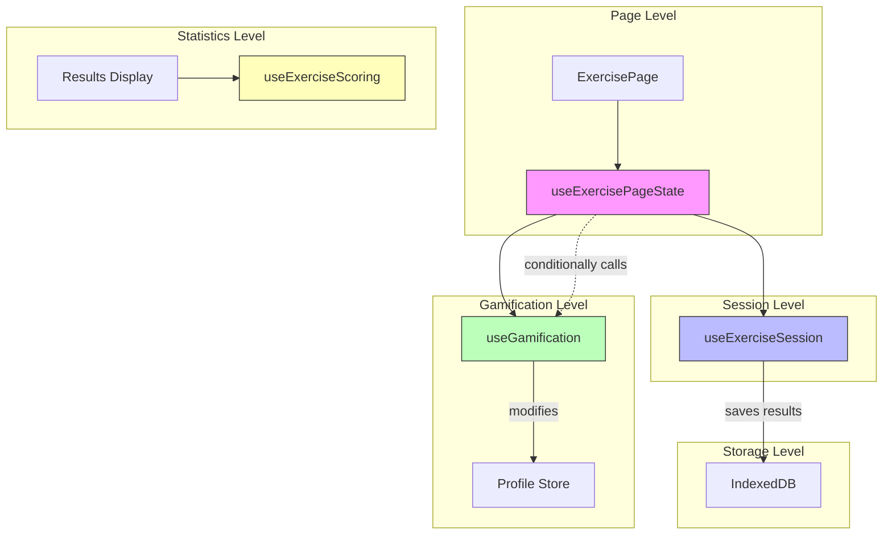

# Hook Architecture Analysis

## Executive Summary

This document analyzes the hook architecture in the mini-trainer-engine project, specifically focusing on five hooks related to exercise management and gamification. The analysis identifies significant overlap and unclear boundaries between these hooks and proposes a clear separation of concerns.

---

## Current Hook Responsibilities

### 1. `useExerciseLogic.ts`

**Primary Responsibility**: Per-exercise interaction logic

Manages the state and behavior of a **single exercise instance**:

- **Answer State Management**: `answer`, `setAnswer`, `isCorrect`
- **Attempt Tracking**: `attempts`, `canRetry`, `maxAttempts`
- **Hint Management**: `currentHintIndex`, `showNextHint`, `hintsUsed`, `shownHints`
- **Solution Display**: `showSolution`, controls when solution is revealed
- **Star Calculation**: `calculateStars(attempts)` - calculates stars based on attempts
- **Feedback Management**: `feedback` state, `showSuccess`, `showError`, `showWarning`
- **Keyboard Handling**: `handleKeyDown` for Enter key submission
- **Time Tracking**: `timeSpentSeconds` for the current exercise
- **Focus Management**: Auto-focus on completion via `containerRef`

**Key Characteristics**:

- Works at the **individual exercise level** (not session)
- Contains `validateAnswer` function passed by caller
- Manages per-exercise UI state (feedback, hints, solution visibility)
- Contains deprecated helpers: `useTextInputExercise`, `useMultipleChoiceExercise`

**State Storage**: Local component state via `useState`

---

### 2. `useGamification.ts`

**Primary Responsibility**: Profile-level gamification progression

Manages **persistent profile-level** gamification state and actions:

- **Star Tracking**: `totalStars`, `processExerciseCompletion(attempts)` - adds stars to profile
- **Level Progression**: `currentLevel`, `levelProgress`, checks for level ups
- **Badge Management**: `badges`, `nextBadges`, `checkForBadges()`, `earnBadge()`
- **Streak Management**: `currentStreak`, `longestStreak`, `incrementStreak()`
- **Notification State**: `notifications.levelUpLevel`, `notifications.earnedBadges`
- **Sound Effects**: Plays level-up and badge sounds
- **Area-based Stats**: `getAreaStars(areaId)`, `getAreaLevel(areaId)`

**Key Characteristics**:

- Works at the **profile level** (persisted across sessions)
- Integrates with `useProfileStore` for persistence
- **Modifies the profile** (addStars, earnBadge, incrementStreak)
- Contains specialized hooks: `useLevelProgress`, `useStreak`, `useBadges`

**State Storage**: Zustand profile store + local notification state

---

### 3. `useExerciseSession.ts`

**Primary Responsibility**: Session lifecycle and navigation

Manages the **exercise session flow** (multi-exercise sequence):

- **Session Lifecycle**: `startSession()`, `endSession()`, uses exerciseStore
- **Exercise Progression**: `currentExercise`, `progress`, `nextExercise()`
- **Answer Submission**: `handleSubmit(correct)`, calls `submitAnswer` in store
- **Navigation**: `handleShowSolution`, `handleNext`, `handleFinish`
- **Result Persistence**: Saves `ExerciseResult` to IndexedDB via `saveExerciseResult()`

**Key Characteristics**:

- Works at the **session level** (sequence of exercises)
- Uses `useExerciseStore` for session state
- Handles **routing** (navigates after completion)
- Does **NOT** handle gamification (delegates to useGamification)

**State Storage**: Zustand exerciseStore + local `hasAnswered` state

---

### 4. `useExercisePageState.ts`

**Primary Responsibility**: Page-level orchestration

Acts as a **facade/orchestrator** combining multiple concerns:

- **Route Parameters**: `themeId`, `areaId`, `level` from URL
- **Exercise Loading**: Filters exercises by theme/area/level
- **Daily Challenge Logic**: Deterministic exercise selection based on date
- **Access Control**: `isLevelAccessible()` check with navigation redirect
- **Session Management**: `startSession()`, `endSession()` orchestration
- **Answer Submission**: `handleSubmit(correct)` with sound effects
- **Gamification Integration**: Calls `processExerciseCompletion()` on correct answers
- **Level Completion**: `updateThemeLevel()` when all exercises in level complete
- **Keyboard Navigation**: Global Enter key handler for next/finish

**Key Characteristics**:

- Works at the **page level** (full exercise page lifecycle)
- **Aggregates** session, gamification, and navigation concerns
- Is the **main hook used by ExercisePage**
- Contains complex daily challenge algorithm

**State Storage**: Multiple stores + local state

---

### 5. `useExerciseScoring.ts`

**Primary Responsibility**: Statistics calculation (read-only)

Provides **analytics and statistics** from exercise results:

- **Overall Stats**: `totalExercises`, `totalCorrect`, `overallAccuracy`
- **Star Stats**: `totalStars`, `maxStars`, `starCompletion`
- **Time & Attempts**: `averageAttempts`, `averageTimeSeconds`
- **Grouped Stats**: `byType`, `byArea`, `byLevel`

**Key Characteristics**:

- **Purely computational** - takes results array, returns computed stats
- **No state mutation** - read-only hook
- Does **NOT** interact with any stores

**State Storage**: None (memoized calculations)

---

## Overlap and Boundary Issues Identified

### Issue 1: Duplicate Answer Submission Logic

**Problem**: Both `useExerciseSession` and `useExercisePageState` implement `handleSubmit`:

```typescript
// useExerciseSession.ts (line 128-142)
const handleSubmit = useCallback((correct: boolean) => {
    incrementAttempts();
    if (correct) {
        playCorrect(soundEnabled);
        submitAnswer(true);
        setHasAnswered(true);
    } else {
        playIncorrect(soundEnabled);
        submitAnswer(false);
        setHasAnswered(true);
    }
}, [incrementAttempts, submitAnswer, soundEnabled]);

// useExercisePageState.ts (line 239-255)
const handleSubmit = useCallback((correct: boolean) => {
    incrementAttempts();
    if (correct) {
        playCorrect(soundEnabled);
        const result = submitAnswer(true);
        if (result.success) { setHasAnswered(true); }
    } else {
        playIncorrect(soundEnabled);
        const result = submitAnswer(false);
        if (result.success) { setHasAnswered(true); }
    }
}, [incrementAttempts, submitAnswer, soundEnabled]);
```

**Impact**: Code duplication, potential for divergence

---

### Issue 2: Gamification Processing Scattered

**Problem**: `useExercisePageState` calls `processExerciseCompletion()`, but the logic is in `useGamification`:

```typescript
// useExercisePageState.ts (line 270-279)
if (!wasPreviouslyCompleted && currentAnswer.correct) {
    processExerciseCompletion(attempts); // From useGamification
}
```

This is correct, but the flow is **scattered across hooks**:

- `useExercisePageState` orchestrates when to call
- `useGamification` implements the logic
- `useExerciseSession` saves results but doesn't call gamification

---

### Issue 3: Session State Duplication

**Problem**: `useExerciseSession` and `useExercisePageState` both manage similar concerns:

| Concern | useExerciseSession | useExercisePageState |
|---------|-------------------|---------------------|
| Session start | ✅ `startSession()` | ✅ `startSession()` |
| Session end | ✅ `endSession()` | ✅ `endSession()` |
| Exercise progression | ✅ `nextExercise()` | ✅ `nextExercise()` |
| Show solution | ✅ `setShowSolution()` | ✅ `setShowSolution()` |
| Answer submission | ✅ `submitAnswer()` | ✅ `submitAnswer()` |
| Attempts | ✅ `incrementAttempts()` | ✅ `incrementAttempts()` |

Both hooks directly access the **same exerciseStore** and perform similar operations.

---

### Issue 4: Unclear Ownership of Sound Effects

**Problem**: Sound playing is scattered across multiple hooks:

| Hook | Sounds Played |
|------|----------------|
| `useExerciseSession` | `playCorrect`, `playIncorrect` |
| `useExercisePageState` | `playCorrect`, `playIncorrect` |
| `useGamification` | `playLevelUp`, `playBadge` |

**Question**: Who owns sound effects? Is this the right location?

---

### Issue 5: `useExerciseLogic` Appears Unused

**Problem**: The documented purpose of `useExerciseLogic` is for per-exercise interaction, but:

1. It's marked with `@deprecated` comments for specialized variants
2. Looking at exercise components, they manage their own local state
3. The hook is **not imported by any exercise component** in the codebase

**Question**: Is `useExerciseLogic` actually used? If not, it's dead code.

---

### Issue 6: Time Tracking Duplication

**Problem**: Both `useExerciseLogic` and `exerciseStore` track time:

```typescript
// useExerciseLogic.ts (line 276-281)
useEffect(() => {
    const interval = setInterval(() => {
        setTimeSpentSeconds(Math.floor((Date.now() - startTime) / 1000));
    }, 1000);
    return () => clearInterval(interval);
}, [startTime]);

// exerciseStore also tracks timeSpentSeconds in answer state
```

---

## Proposed Separation of Concerns

### Recommended Architecture



### Explicit Boundaries

| Hook | Responsibility | Boundaries |
|------|----------------|------------|
| **`useExercisePageState`** | Page orchestration, routing, daily challenges, access control | Coordinates other hooks; handles URL params |
| **`useExerciseSession`** | Session flow, navigation, result saving | Handles routing; delegates gamification to useGamification |
| **`useGamification`** | Profile progression, badges, levels, streaks | **Mutates** profile store; handles all gamification |
| **`useExerciseScoring`** | Statistics calculation | **Pure function** - no side effects |
| **`useExerciseLogic`** | Per-exercise UI state | If used: per-component; if unused: remove |

---

## Refactoring Recommendations

### Priority 1: Consolidate Session Management

**Option A**: Simplify to use either `useExerciseSession` OR `useExercisePageState` exclusively

**Option B** (Recommended): Have `useExercisePageState` delegate session handling to `useExerciseSession`:

```typescript
// New useExercisePageState would look like:
export function useExercisePageState(): UseExercisePageStateReturn {
    const session = useExerciseSession({ exercises, themeId, areaId });
    const gamification = useGamification();
    
    // Only add page-specific concerns here:
    // - Route params
    // - Daily challenge logic  
    // - Access control
    // - Level completion tracking
    
    return {
        ...session,
        ...gamification,
        // Page-specific handlers that call session/gamification
    };
}
```

### Priority 2: Remove or Revive `useExerciseLogic`

**Option A**: If unused, delete it:

```bash
# Verify it's not imported anywhere
grep -r "useExerciseLogic" src/
```

**Option B**: If needed, clarify its role as per-exercise component state

### Priority 3: Consolidate Sound Effects

Create a dedicated hook or utility:

```typescript
// useSoundEffects.ts
export function useSoundEffects() {
    const soundEnabled = useAppStore(s => s.settings.soundEnabled);
    
    const playCorrect = useCallback(() => {
        if (soundEnabled) playCorrectSound();
    }, [soundEnabled]);
    
    const playLevelUp = useCallback(() => {
        if (soundEnabled) playLevelUpSound();
    }, [soundEnabled]);
    
    // ... other sounds
    
    return { playCorrect, playLevelUp, playBadge, ... };
}
```

### Priority 4: Clarify Time Tracking

Choose ONE location for time tracking:

- **Option A**: In `exerciseStore` (current) - session-level tracking
- **Option B**: In `useExerciseLogic` - per-exercise tracking

Remove duplication.

---

## Summary

| Hook | Current Status | Recommendation |
|------|----------------|----------------|
| `useExerciseLogic` | Appears unused | Investigate usage; delete if dead code |
| `useGamification` | Well-defined role | Keep as-is |
| `useExerciseSession` | Overlaps with useExercisePageState | Delegate to or merge with useExercisePageState |
| `useExercisePageState` | Orchestration hub | Simplify by delegating to useExerciseSession |
| `useExerciseScoring` | Pure computation | Keep as-is |

**Key Action Items**:

1. ✅ Verify if `useExerciseLogic` is actually used in the codebase
2. 🔄 Decide on session management strategy (Option A or B above)
3. 🔄 Consolidate sound effects into dedicated hook
4. 🔄 Remove time tracking duplication
