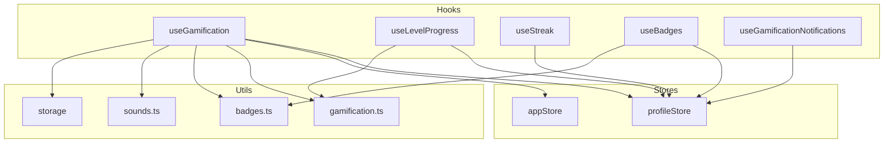
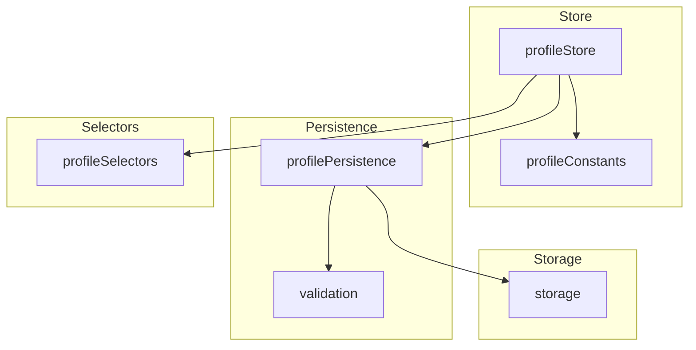

# Large File Decomposition Analysis

**Date:** 2026-03-01  
**Files Analyzed:**

- `src/core/hooks/useGamification.ts` (14,355 chars / ~424 lines)
- `src/core/stores/profileStore.ts` (12,032 chars / ~355 lines)

---

## 1. useGamification.ts Analysis

### Current Line Count & Responsibilities

| Responsibility | Lines | Description |
|---------------|-------|-------------|
| Type definitions | 1-121 | Interfaces for return types and options |
| Main hook implementation | 131-356 | Core gamification orchestration |
| useLevelProgress | 365-372 | Specialized hook (already extracted) |
| useStreak | 377-391 | Specialized hook (already extracted) |
| useBadges | 396-422 | Specialized hook (already extracted) |

### Distinct Responsibilities Identified

1. **Star Calculation/Tracking** - Uses `@core/utils/gamification` for `calculateStars`
2. **Level Progression** - Uses `calculateLevel`, `getLevelProgress` from utils
3. **Badge Checking/Earning** - Uses `checkAllBadges` from badges utils
4. **Streak Management** - Uses `updateStreak` from utils
5. **Notification State** - Local React state for UI (earned badges, level up)
6. **Sound Effects** - Plays sounds via `@core/utils/sounds`
7. **Area-specific Data** - Async fetching for area stars/levels

### Dependency Graph

```
useGamification.ts
├── @core/stores/profileStore (read profile, call actions)
├── @core/stores/appStore (sound settings)
├── @core/utils/gamification (stars, level, streak calcs)
├── @core/utils/badges (badge checking)
├── @core/storage (getExerciseResultsByArea)
└── @core/utils/sounds (playLevelUp, playBadge)
```

### Decomposition Plan

#### Option A: Minimal Refactor (Recommended)

Extract notification state management - this is the clearest violation of SRP.

| New File | Responsibility | Est. Lines |
|----------|----------------|------------|
| `useGamificationNotifications.ts` | Badge/level-up notification state & actions | ~60 |

**Contents:**

- `GamificationNotifications` interface
- `earnedBadges`, `levelUpLevel`, `currentBadgeIndex` state
- `dismissBadge()`, `clearLevelUp()` actions
- Notification state computation

#### Option B: Full Decomposition

Extract area-specific data fetching.

| New File | Responsibility | Est. Lines |
|----------|----------------|------------|
| `useGamificationNotifications.ts` | Notification state management | ~60 |
| `useAreaProgress.ts` | Area-specific stars/levels | ~40 |

**useAreaProgress would handle:**

- `getAreaStars(areaId)` - async from IndexedDB
- `getAreaLevel(areaId)` - from profile store

### Backward Compatibility

- Keep re-exporting specialized hooks from main file
- Use composition in main hook to maintain API

### Circular Dependencies

**No circular dependencies detected.** The hook imports from utilities, not vice versa.

---

## 2. profileStore.ts Analysis

### Current Line Count & Responsibilities

| Responsibility | Lines | Description |
|---------------|-------|-------------|
| Constants | 44-66 | AVATAR_EMOJIS, MAX_NICKNAME_LENGTH |
| Type definitions | 71-107 | ProfileState interface |
| Store creation | 132-320 | Zustand store with all actions |
| IndexedDB sync | 330-336 | Subscription for persistence |
| Selector re-exports | 343-355 | Backwards compatibility |

### Already Extracted

| Module | Responsibility |
|--------|----------------|
| `profilePersistence.ts` (500+ lines) | Export/import, validation, IndexedDB sync |
| `profileSelectors.ts` (148 lines) | Selector functions |

### Distinct Responsibilities Identified

1. **Profile CRUD** - createProfile, setActiveProfile, clearProfile
2. **Profile Field Updates** - setNickname, setAvatar
3. **Level Management** - updateLevel for observation areas
4. **Stars Management** - addStars
5. **Streak Management** - incrementStreak, resetStreak
6. **Theme Progress** - updateThemeProgress, updateThemeLevel
7. **Badge Earning** - earnBadge
8. **Persistence Config** - Zustand persist middleware
9. **IndexedDB Sync** - Store subscription
10. **Constants** - AVATAR_EMOJIS, MAX_NICKNAME_LENGTH

### Dependency Graph

```
profileStore.ts
├── zustand (create, persist)
├── profilePersistence (exportSaveGame, importSaveGame, syncProfileToIndexedDB)
├── profileSelectors (re-exports)
└── @/types (UserProfile, Badge, etc.)
```

### Decomposition Plan

#### Option A: Extract Constants (Recommended)

Move constants to dedicated file - smallest change with clear benefit.

| New File | Responsibility | Est. Lines |
|----------|----------------|------------|
| `profileConstants.ts` | AVATAR_EMOJIS, MAX_NICKNAME_LENGTH | ~25 |

**Contents:**

```typescript
export const AVATAR_EMOJIS = [...] as const;
export const MAX_NICKNAME_LENGTH = 20;
```

#### Option B: Extract Sync Logic

The IndexedDB sync subscription could be separated.

| New File | Responsibility | Est. Lines |
|----------|----------------|------------|
| `profileConstants.ts` | AVATAR_EMOJIS, MAX_NICKNAME_LENGTH | ~25 |
| `profileSync.ts` | IndexedDB sync subscription | ~30 |

### Backward Compatibility

- Re-export from new location in profileStore
- Update imports in consuming files gradually

### Circular Dependencies

**Potential barrier:** The store depends on `profilePersistence`, which imports from `@core/storage`. The storage layer should remain independent.

```
profileStore → profilePersistence → @core/storage
                     ↓
              (no cycles back)
```

---

## 3. Summary & Recommendations

### Priority Matrix

| File | Impact | Effort | Priority |
|------|--------|--------|----------|
| useGamification: Extract notifications | High | Low | **HIGH** |
| profileStore: Extract constants | Low | Low | **MEDIUM** |
| profileStore: Extract sync | Medium | Medium | **MEDIUM** |
| useGamification: Extract area progress | Medium | Medium | **LOW** |

### Key Findings

1. **useGamification.ts** is reasonably well-structured - the utility layer already exists. The main opportunity is extracting notification state which mixes UI logic with gamification business logic.

2. **profileStore.ts** has already undergone decomposition - persistence and selectors are separated. The remaining constants could be extracted.

3. **No circular dependencies** prevent decomposition in either file.

4. **Testability** would improve by extracting notification state (currently difficult to test without mocking React state).

### Implementation Order

1. Extract `useGamificationNotifications` from useGamification.ts
2. Extract `profileConstants.ts` from profileStore.ts
3. Optionally extract `profileSync.ts` if needed

---

## Appendix: Mermaid Dependency Diagrams

### useGamification Dependencies



### profileStore Dependencies


