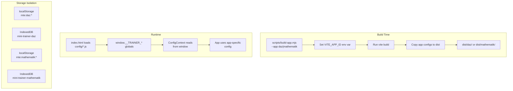

# Multi-App Architecture Implementation Plan

## Executive Summary

The multi-app architecture is **substantially implemented**. The codebase already has:

- App-specific configuration directories (`src/apps/daz/`, `src/apps/mathematik/`)
- App-aware configuration loader with caching
- Storage isolation (IndexedDB and localStorage)
- Build scripts for individual apps
- npm scripts for development and building

This analysis identifies what's complete, what's missing, and provides an actionable implementation plan.

---

## Architecture Overview



---

## Current Implementation Status

### ✅ Fully Implemented

| Component | File(s) | Status |
|-----------|---------|--------|
| App directory structure | `src/apps/{app}/` | ✅ Complete |
| App identity config | `src/apps/*/app.json` | ✅ Complete |
| Subject/Areas/Themes/Badges | `src/apps/*/*.json` | ✅ Complete |
| Exercise data | `src/apps/*/exercises.json` | ✅ Complete |
| Config loader | `src/core/config/loader.ts` | ✅ Complete |
| Config context | `src/core/config/ConfigContext.tsx` | ✅ Complete |
| Storage isolation (IndexedDB) | `src/core/storage/db.ts` | ✅ Complete |
| Storage isolation (localStorage) | `src/core/storage/localStorage.ts` | ✅ Complete |
| Build script | `scripts/build-app.mjs` | ✅ Complete |
| Package scripts | `package.json` | ✅ Complete |

### ⚠️ Partially Implemented

| Component | Issue | Priority |
|-----------|-------|----------|
| Vite define injection | `VITE_APP_ID` not injected via `define` plugin | Medium |
| App-specific assets | Icons referenced in `app.json` don't exist | Low |
| HomePage branding | Not using app-specific primary color | Low |

### ❌ Not Required

| Component | Reason |
|-----------|--------|
| Runtime app switching | Single build = single app (correct design) |
| Dynamic routing | Each app has its own build output |

---

## Detailed Analysis

### 1. App Configuration Structure ✅

Both apps have proper configuration:

```json
// src/apps/daz/app.json
{
  "id": "daz",
  "name": "Deutsch als Zweitsprache",
  "display": {
    "primaryColor": "#3b82f6",
    "icon": "/assets/daz-icon.svg"
  },
  "terminology": {
    "level": "Wortschatz-Level"
  }
}

// src/apps/mathematik/app.json
{
  "id": "mathematik",
  "name": "Mathematik Grundstufe",
  "display": {
    "primaryColor": "#10b981",
    "icon": "/assets/mathematik-icon.svg"
  },
  "terminology": {
    "level": "Level"
  }
}
```

**Status**: ✅ Complete - Both apps have distinct branding and terminology.

---

### 2. Configuration Loading ✅

The loader at [`src/core/config/loader.ts`](src/core/config/loader.ts) supports:

1. **Window globals** (USB/offline mode):

   ```typescript
   window.__TRAINER_SUBJECT__
   window.__TRAINER_AREAS__
   window.__TRAINER_THEMES__
   window.__TRAINER_BADGES__
   window.__TRAINER_EXERCISES__
   ```

2. **Fetch** (PWA mode):
   - Tries `./config/{filename}` first
   - Falls back to `./config/default/{filename}`

**Status**: ✅ Complete with fallback support.

---

### 3. Storage Isolation ✅

IndexedDB and localStorage use app-specific prefixes:

**localStorage** ([`src/core/storage/localStorage.ts:66-68`](src/core/storage/localStorage.ts:66)):

```typescript
function getKeyPrefix(): string {
    return `mte:${getAppId()}:`;
}
```

**IndexedDB** ([`src/core/storage/db.ts:38-40`](src/core/storage/db.ts:38)):

```typescript
export function getDatabaseName(): string {
    const trainerId = getTrainerId();
    return `mini-trainer-${trainerId}`;
}
```

**Status**: ✅ Complete - Each app gets isolated storage.

---

### 4. Build System ✅

The [`scripts/build-app.mjs`](scripts/build-app.mjs) script:

1. ✅ Validates app exists in `src/apps/{appId}/`
2. ✅ Builds exercise data to `public/data/{appId}/`
3. ✅ Runs TypeScript check
4. ✅ Runs Vite build with `VITE_APP_ID` env var
5. ✅ Copies config files as IIFE scripts
6. ✅ Copies exercise data to `dist/{appId}/data/exercises.js`

**npm scripts** ([`package.json`](package.json:6-16)):

```json
"dev:daz": "VITE_APP_ID=daz vite",
"dev:math": "VITE_APP_ID=mathematik vite",
"build:daz": "node scripts/build-app.mjs --app daz",
"build:math": "node scripts/build-app.mjs --app mathematik"
```

**Status**: ✅ Complete.

---

### 5. Vite Configuration ⚠️

Current [`vite.config.ts`](vite.config.ts) does NOT use the `define` plugin to inject `VITE_APP_ID` at build time:

```typescript
// Current - relies on process.env at runtime
export default defineConfig({
    // ... no define plugin
});
```

The build script sets the environment variable, which works, but the recommended approach per the architecture doc is to use `define` for compile-time injection.

**Status**: ⚠️ Works but not optimal - needs `define` plugin for proper build-time injection.

---

### 6. Missing App Assets ❌

The app.json references icons that don't exist:

| App | Configured Icon | Status |
|-----|-----------------|--------|
| daz | `/assets/daz-icon.svg` | ❌ Missing |
| mathematik | `/assets/mathematik-icon.svg` | ❌ Missing |

These should be created in `src/apps/{app}/assets/`.

---

## Implementation Plan

### Phase 1: Verify Current Functionality

**Goal**: Ensure both apps build and run correctly with existing implementation.

- [ ] **1.1** Run `npm run build:daz` and verify output in `dist/daz/`
- [ ] **1.2** Run `npm run build:math` and verify output in `dist/mathematik/`
- [ ] **1.3** Test both builds in browser (using preview or local server)
- [ ] **1.4** Verify storage isolation by:
  - Creating a profile in daz build
  - Checking IndexedDB database name is `mini-trainer-daz`
  - Creating a profile in mathematik build
  - Checking IndexedDB database name is `mini-trainer-mathematik`

### Phase 2: Improve Build Configuration

**Goal**: Add proper build-time injection of app ID.

- [ ] **2.1** Update [`vite.config.ts`](vite.config.ts) to use `define` plugin:

  ```typescript
  define: {
    'import.meta.env.VITE_APP_ID': JSON.stringify(process.env.VITE_APP_ID || 'daz'),
  }
  ```

- [ ] **2.2** Update the title injection to read from app config

### Phase 3: Add App-Specific Assets

**Goal**: Create proper icons and branding for each app.

- [ ] **3.1** Create `src/apps/daz/assets/daz-icon.svg`
- [ ] **3.2** Create `src/apps/mathematik/assets/mathematik-icon.svg`
- [ ] **3.3** Verify icons appear correctly in builds

### Phase 4: Enhance UI with App Identity

**Goal**: Use app-specific terminology and colors in the UI.

- [ ] **4.1** Update HomePage to use app's `primaryColor` for branding
- [ ] **4.2** Use terminology from `app.json` (level vs Wortschatz-Level)
- [ ] **4.3** Add app name to page title or header

### Phase 5: Testing & Documentation

**Goal**: Ensure robustness and document the system.

- [ ] **5.1** Add integration tests for storage isolation
- [ ] **5.2** Update `docs/MULTI_APP_ARCHITECTURE.md` with actual implementation details
- [ ] **5.3** Test PWA builds: `npm run build:daz:pwa`

---

## Testing Checklist

Run these commands to verify the implementation:

```bash
# Build both apps
npm run build:daz
npm run build:math

# Check output directories exist
ls dist/daz/
ls dist/mathematik/

# Verify config files in each build
cat dist/daz/config/subject.js | head -5
cat dist/mathematik/config/subject.js | head -5

# Verify exercise data in each build
cat dist/daz/data/exercises.js | head -10
cat dist/mathematik/data/exercises.js | head -10

# Test in browser
# Open dist/daz/index.html and verify:
# - Title shows "Deutsch als Zweitsprache"
# - Primary color is blue (#3b82f6)

# Open dist/mathematik/index.html and verify:
# - Title shows "Mathematik Grundstufe"  
# - Primary color is green (#10b981)
```

---

## Risk Assessment

| Risk | Likelihood | Impact | Mitigation |
|------|------------|--------|------------|
| Config loading fails in dev mode | Low | Medium | Check that `npm run dev:daz` works |
| Storage not isolated properly | Low | High | Run isolation tests in Phase 1 |
| Missing assets break builds | Low | Low | Assets are optional in current implementation |

---

## Recommendations

1. **Start with Phase 1**: Verify current implementation works before making changes
2. **Add define plugin in Phase 2**: This is the recommended approach per architecture docs
3. **Prioritize Phase 4**: Using app-specific terminology improves user experience significantly

---

## Conclusion

The multi-app architecture is **already functional**. Both daz and mathematik apps can be built and run from a single codebase with proper storage isolation. The remaining work is primarily cosmetic (icons, colors) and incremental improvements (define plugin).

**Estimated effort**: 2-4 hours for full implementation including testing.
