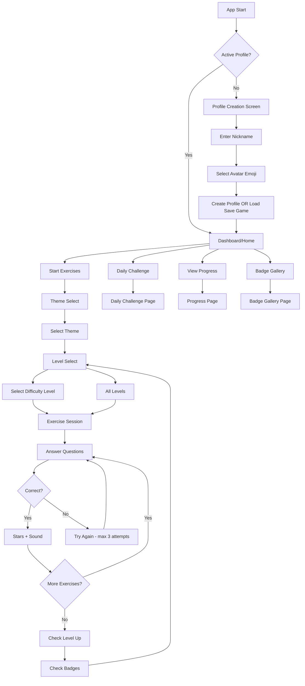

# Mini-DAZ-Trainer-Kids Original App Analysis

This document provides a comprehensive analysis of the original mini-daz-trainer-kids application to guide the correct implementation in mini-trainer-engine.

## Table of Contents

1. [Application Flow Overview](#application-flow-overview)
2. [Profile System](#profile-system)
3. [Theme Selection](#theme-selection)
4. [Difficulty Progression](#difficulty-progression)
5. [Gamification System](#gamification-system)
6. [Save Game Functionality](#save-game-functionality)
7. [Component Structure](#component-structure)
8. [Data Structures](#data-structures)
9. [Key Implementation Details](#key-implementation-details)
10. [Recommendations for mini-trainer-engine](#recommendations-for-mini-trainer-engine)

---

## Application Flow Overview

### Route Structure

```
/                    -> HomePage (profile creation OR dashboard)
/themes              -> ThemeSelectPage (theme grid)
/levels/:themeId     -> LevelSelectPage (difficulty selection)
/exercise/:themeId   -> ExercisePage (exercise session)
/exercise/:themeId/:areaId -> ExercisePage (filtered by area)
/progress            -> ProgressPage (stats and badges)
/settings            -> SettingsPage (preferences + save/load)
/badges              -> BadgeGalleryPage (full badge display)
/daily-challenge     -> DailyChallengePage (5 mixed exercises)
/teacher/pin         -> TeacherPinPage (PIN entry)
/teacher/dashboard   -> TeacherDashboardPage (student management)
```

### User Journey Flow



---

## Profile System

### Profile Creation Screen

**Location**: [`HomePage.tsx`](../mini-daz-trainer-kids/src/pages/HomePage.tsx) - lines 85-180

**UI Components**:

1. **Title Section**: App title and subtitle
2. **Nickname Input**: Text input with placeholder, max 20 characters, auto-focus
3. **Avatar Picker**: Grid of 12 emoji avatars with selection highlight
4. **Create Button**: Disabled until nickname entered
5. **Divider**: "OR" separator
6. **Load Save Game**: File input for JSON import

**Avatar Options**:

```typescript
const AVATARS = ['&#x1F98A;', '&#x1F43B;', '&#x1F430;', '&#x1F981;', '&#x1F438;', '&#x1F43C;', '&#x1F984;', '&#x1F415;', '&#x1F431;', '&#x1F435;', '&#x1F98B;', '&#x1F31F;'];
// Fox, Bear, Bunny, Lion, Frog, Panda, Unicorn, Dog, Cat, Monkey, Butterfly, Star
```

**Profile Creation Logic**:

```typescript
const profile: ChildProfile = {
    id: crypto.randomUUID(),
    nickname: nickname.trim(),
    avatarId: selectedAvatar,        // emoji string
    createdAt: new Date().toISOString(),
    currentLevels: createInitialLevels(),  // All areas start at level 1
    totalStars: 0,
    currentStreak: 0,
    longestStreak: 0,
    lastActiveDate: '',
    themeProgress: {},               // Empty initially
    badges: [],                      // Empty initially
};
```

### Profile Storage

**Dual Storage Strategy**:

1. **localStorage**: Via Zustand persist middleware (key: `daz-trainer-child`)
2. **IndexedDB**: Sync via subscription in [`childStore.ts`](../mini-daz-trainer-kids/src/stores/childStore.ts) - lines 129-135

```typescript
// Sync activeProfile to IndexedDB whenever it changes
useChildStore.subscribe((state, prevState) => {
    if (state.activeProfile && state.activeProfile !== prevState.activeProfile) {
        void saveChildProfile(state.activeProfile);
    }
});
```

### Dashboard Screen

**Location**: [`HomePage.tsx`](../mini-daz-trainer-kids/src/pages/HomePage.tsx) - lines 183-268

**UI Components**:

1. **Welcome Header**: Avatar emoji + "Welcome back, {name}"
2. **Stats Cards** (2-column grid):
   - Total Stars card with star icon
   - Current Streak card with fire icons (1-3 fires based on streak length)
3. **Streak Status**: Text showing if streak is active or lost
4. **Action Buttons**:
   - Start Exercises (primary button)
   - Daily Challenge (secondary, disabled if completed)
   - View Progress + Badge Gallery (2-column grid)

---

## Theme Selection

### ThemeSelectPage

**Location**: [`ThemeSelectPage.tsx`](../mini-daz-trainer-kids/src/pages/ThemeSelectPage.tsx)

**UI Components**:

1. **Title**: "Themen" (Themes)
2. **Global Level Indicator**: Level dots + text showing current vocabulary level
3. **Theme Grid** (2 columns): Cards for each theme

**Theme Card Structure**:

```tsx
<button
    onClick={() => isUnlocked && navigate(`/levels/${theme.id}`)}
    disabled={!isUnlocked}
    style={{ borderLeft: `4px solid ${theme.color}` }}
>
    {/* Icon + Name */}
    <span className="text-2xl">{theme.icon}</span>
    <span className="font-bold">{t(`themes.${theme.id}`)}</span>
    
    {/* Description */}
    <p className="text-xs text-gray-500">{theme.description}</p>
    
    {/* Unlocked: Exercise count + min-level badge + progress bar */}
    {/* Locked: "Locked until level X" message */}
</button>
```

**Theme Data Structure**:

```typescript
interface Theme {
    id: ThemeId;
    name: string;           // German name
    icon: string;           // Emoji icon
    color: string;          // Hex color for theming
    description: string;    // German description
    minLevel: number;       // Required vocabulary level (1-4)
}
```

**Theme Unlocking Logic**:

- Each theme has a `minLevel` property (1-4)
- User's vocabulary level must be >= theme's minLevel
- Vocabulary level is derived from total stars

**Progress Display**:

- Progress bar showing completed/total exercises
- Stars earned in theme
- Percentage calculation

---

## Difficulty Progression

### LevelSelectPage

**Location**: [`LevelSelectPage.tsx`](../mini-daz-trainer-kids/src/pages/LevelSelectPage.tsx)

**UI Components**:

1. **Back Button**: Return to themes
2. **Theme Header**: Icon + name + description
3. **Level Cards** (4 levels): Each with emoji, label, exercise count, completion status
4. **All Levels Button**: Play all exercises regardless of level

**Level Configuration**:

```typescript
const LEVEL_EMOJI = ['&#x1F331;', '&#x1F33F;', '&#x1F333;', '&#x1F3C6;']; // Seedling, Herb, Tree, Trophy
const LEVEL_COLORS = ['#4CAF50', '#2196F3', '#FF9800', '#9C27B0'];
// Green, Blue, Orange, Purple
```

**Level Labels** (from i18n):

- Level 1: "Anfänger" (Beginner)
- Level 2: "Elementar" (Elementary)
- Level 3: "Mittelstufe" (Intermediate)
- Level 4: "Fortgeschritten" (Advanced)

**Unlocking Logic**:

- User's vocabulary level determines which difficulty levels are unlocked
- Level 1 always unlocked
- Levels 2-4 require corresponding vocabulary level

**Completion Tracking**:

- Fetched from IndexedDB (`getExerciseResultsByChild`)
- Shows "X/Y completed" for each level

### Level Thresholds

**Location**: [`levelThresholds.ts`](../mini-daz-trainer-kids/src/utils/levelThresholds.ts)

```typescript
/**
 * Derives the Wortschatz-Level from total stars.
 * Thresholds are intentionally low for quick progress.
 * 
 *   >=  4 stars -> Level 2
 *   >= 12 stars -> Level 3
 *   >= 20 stars -> Level 4
 */
export function levelFromStars(totalStars: number): number {
    if (totalStars >= 20) return 4;
    if (totalStars >= 12) return 3;
    if (totalStars >= 4) return 2;
    return 1;
}
```

---

## Gamification System

### Stars

**Earning Logic** (from [`useExerciseScoring.ts`](../mini-daz-trainer-kids/src/hooks/useExerciseScoring.ts)):

```typescript
function calculateStars(attempt: number): number {
    if (attempt === 1) return 3;  // First try: 3 stars
    if (attempt === 2) return 2;  // Second try: 2 stars
    if (attempt === 3) return 1;  // Third try: 1 star
    return 0;                     // After showing solution: 0 stars
}
```

**Maximum Attempts**: 3 per exercise

### Streaks

**Calculation** (from [`childStore.ts`](../mini-daz-trainer-kids/src/stores/childStore.ts)):

```typescript
incrementStreak: () => set((state) => {
    if (!state.activeProfile) return state;
    const today = new Date().toISOString().split('T')[0];
    const lastActive = state.activeProfile.lastActiveDate;

    // If already active today, no change
    if (lastActive === today) return state;

    // Check if yesterday
    const yesterday = new Date();
    yesterday.setDate(yesterday.getDate() - 1);
    const yesterdayStr = yesterday.toISOString().split('T')[0];

    const newStreak = lastActive === yesterdayStr
        ? state.activeProfile.currentStreak + 1  // Continue streak
        : 1;                                       // Reset to 1

    return {
        activeProfile: {
            ...state.activeProfile,
            currentStreak: newStreak,
            longestStreak: Math.max(newStreak, state.activeProfile.longestStreak),
            lastActiveDate: today,
        },
    };
}),
```

**Display**:

- Fire emoji count based on streak length:
  - 1-2 days: 1 fire
  - 3-6 days: 2 fires
  - 7+ days: 3 fires

### Badges

**Badge Definitions** (from [`badges.ts`](../mini-daz-trainer-kids/src/data/badges.ts)):

| ID | Name | Description | Icon | Condition |
|----|------|-------------|------|-----------|
| first-star | Erster Stern | First star earned | &#x2B50; | totalStars >= 1 |
| star-collector-10 | Sternesammler | 10 stars collected | &#x1F31F; | totalStars >= 10 |
| star-collector-25 | Sternenheld | 25 stars collected | &#x1F4AB; | totalStars >= 25 |
| star-collector-50 | Sternenmeister | 50 stars collected | &#x2728; | totalStars >= 50 |
| streak-3 | Dranbleiber | 3 days streak | &#x1F525; | longestStreak >= 3 |
| streak-7 | Wochenchampion | 7 days streak | &#x1F3C6; | longestStreak >= 7 |
| level-2 | Aufsteiger | Level 2 reached | &#x1F4C8; | wortschatz level >= 2 |
| level-3 | Sprachprofi | Level 3 reached | &#x1F393; | wortschatz level >= 3 |
| level-4 | Sprachgenie | Level 4 reached | &#x1F451; | wortschatz level >= 4 |
| first-theme | Erstentdecker | First theme completed | &#x1F5FA; | Any theme 100% complete |

**Badge Checking**:

```typescript
export function checkNewBadges(profile: ChildProfile): Badge[] {
    const earned = new Set(profile.badges.map((b) => b.id));
    const now = new Date().toISOString();

    return badgeDefinitions
        .filter((def) => !earned.has(def.badge.id) && def.check(profile))
        .map((def) => ({ ...def.badge, earnedAt: now }));
}
```

### Sounds

**Location**: [`sounds.ts`](../mini-daz-trainer-kids/src/utils/sounds.ts)

**Implementation**: Web Audio API (no external files needed, works offline)

**Sound Effects**:

```typescript
// Correct answer: Ascending chime (C5 -> E5 -> G5)
playCorrect(): void

// Incorrect answer: Low buzz (A3 -> G3)
playIncorrect(): void

// Level up: Celebratory ascending scale
playLevelUp(): void

// Badge earned: Sparkle sound
playBadge(): void

// Star earned: Twinkle (pitch varies by index)
playStar(index: number): void
```

### Level Up Celebration

**Location**: [`LevelUpCelebration.tsx`](../mini-daz-trainer-kids/src/components/LevelUpCelebration.tsx)

**Features**:

- Full-screen overlay with dark background
- 40 CSS confetti particles with random colors, positions, and animations
- Bouncing card with level emoji, number, and title
- Auto-dismiss after 4.5 seconds or on tap
- Focus trap for accessibility

**Level Emojis**:

- Level 2: &#x1F31F; (Star with rays)
- Level 3: &#x1F680; (Rocket)
- Level 4: &#x1F451; (Crown)

### Badge Notification

**Location**: [`BadgeNotification.tsx`](../mini-daz-trainer-kids/src/components/BadgeNotification.tsx)

**Features**:

- Full-screen overlay
- Shows all newly earned badges
- Auto-dismiss after 3.5 seconds or on tap
- Focus trap for accessibility

---

## Save Game Functionality

### Export

**Location**: [`dataExport.ts`](../mini-daz-trainer-kids/src/utils/dataExport.ts) - `exportSaveGame()`

**Exported Data**:

```typescript
interface SaveGamePayload {
    version: 2;
    savedAt: string;              // ISO timestamp
    appSettings: AppSettings;     // Sound, font size, contrast, animations, teacher PIN
    childProfile: ChildProfile;   // Full profile with all progress
    exerciseResults: ExerciseResult[];  // All exercise results
}
```

**File Naming**: `daz-spielstand-{nickname}-{date}.json`

**Download Method**: Blob + temporary anchor element (works on file:// protocol)

### Import

**Location**: [`dataExport.ts`](../mini-daz-trainer-kids/src/utils/dataExport.ts) - `importSaveGame()`

**Process**:

1. Parse and validate JSON file
2. Clear all existing IndexedDB data
3. Write imported profile and results to IndexedDB
4. Restore app settings to Zustand store
5. Set imported profile as active

**Validation**:

- Checks version === 2
- Validates required fields exist

### Settings Page Integration

**Location**: [`SettingsPage.tsx`](../mini-daz-trainer-kids/src/pages/SettingsPage.tsx)

**Save Game Section**:

1. **Save Game Button**: Triggers download
2. **Load Game Button**: File input with confirmation dialog
3. **Export PDF Button**: Navigates to progress page and triggers print

---

## Component Structure

### Page Components

| Page | Path | Purpose |
|------|------|---------|
| HomePage | `/pages/HomePage.tsx` | Profile creation + Dashboard |
| ThemeSelectPage | `/pages/ThemeSelectPage.tsx` | Theme grid selection |
| LevelSelectPage | `/pages/LevelSelectPage.tsx` | Difficulty level selection |
| ExercisePage | `/pages/ExercisePage.tsx` | Exercise session |
| ProgressPage | `/pages/ProgressPage.tsx` | Stats and progress display |
| SettingsPage | `/pages/SettingsPage.tsx` | Settings + save/load |
| BadgeGalleryPage | `/pages/BadgeGalleryPage.tsx` | Full badge display |
| DailyChallengePage | `/pages/DailyChallengePage.tsx` | Daily 5 mixed exercises |

### Shared Components

| Component | Path | Purpose |
|-----------|------|---------|
| BottomNav | `/components/BottomNav.tsx` | Navigation bar |
| ErrorBoundary | `/components/ErrorBoundary.tsx` | Error handling |
| LevelUpCelebration | `/components/LevelUpCelebration.tsx` | Level up overlay |
| BadgeNotification | `/components/BadgeNotification.tsx` | Badge earned overlay |

### Exercise Components

| Component | Path | Exercise Type |
|-----------|------|---------------|
| MultipleChoiceExercise | `/components/exercises/MultipleChoiceExercise.tsx` | Multiple choice |
| MatchingExercise | `/components/exercises/MatchingExercise.tsx` | Matching pairs |
| FillBlankExercise | `/components/exercises/FillBlankExercise.tsx` | Fill in blanks |
| WordOrderExercise | `/components/exercises/WordOrderExercise.tsx` | Word ordering |
| SentenceBuilderExercise | `/components/exercises/SentenceBuilderExercise.tsx` | Sentence building |
| CategorySortExercise | `/components/exercises/CategorySortExercise.tsx` | Category sorting |
| ConjugationTableExercise | `/components/exercises/ConjugationTableExercise.tsx` | Conjugation tables |
| ConnectorInsertExercise | `/components/exercises/ConnectorInsertExercise.tsx` | Connector insertion |
| PictureVocabularyExercise | `/components/exercises/PictureVocabularyExercise.tsx` | Picture vocabulary |
| WritingExercise | `/components/exercises/WritingExercise.tsx` | Free writing |
| ExerciseRenderer | `/components/exercises/ExerciseRenderer.tsx` | Exercise router |
| HintButton | `/components/exercises/HintButton.tsx` | Hint display |

---

## Data Structures

### ChildProfile

```typescript
interface ChildProfile {
    id: string;
    nickname: string;
    avatarId: string;                              // Emoji string
    createdAt: string;                             // ISO timestamp
    currentLevels: Record<ObservationAreaId, number>;  // Area -> level (1-4)
    totalStars: number;
    currentStreak: number;
    longestStreak: number;
    lastActiveDate: string;                       // YYYY-MM-DD format
    themeProgress: Record<ThemeId, ThemeProgress>;
    badges: Badge[];
}
```

### ThemeProgress

```typescript
interface ThemeProgress {
    unlocked: boolean;
    exercisesCompleted: number;
    exercisesTotal: number;
    starsEarned: number;
    maxStars: number;                              // exercisesTotal * 3
}
```

### Badge

```typescript
interface Badge {
    id: string;
    name: string;
    description: string;
    icon: string;                                  // Emoji string
    earnedAt: string;                              // ISO timestamp
}
```

### ExerciseResult

```typescript
interface ExerciseResult {
    id: string;
    childProfileId: string;
    exerciseId: string;
    areaId: ObservationAreaId;
    themeId: ThemeId;
    level: number;
    correct: boolean;
    score: number;                                 // 0-3 stars
    attempts: number;
    timeSpentSeconds: number;
    completedAt: string;                           // ISO timestamp
}
```

---

## Key Implementation Details

### 1. Profile Creation Flow

1. Check for `activeProfile` in childStore
2. If null, show profile creation screen
3. User enters nickname and selects avatar
4. On "Create" button click:
   - Create profile object with initial values
   - Save to IndexedDB via `saveChildProfile()`
   - Set as active profile in store
5. If "Load Save Game" clicked:
   - Open file picker
   - Parse JSON and validate
   - Clear existing data
   - Import profile, results, and settings
   - Set as active profile

### 2. Theme Selection Flow

1. On mount, sync vocabulary level from total stars
2. Display all themes in 2-column grid
3. For each theme:
   - Check if unlocked (vocabLevel >= theme.minLevel)
   - Calculate progress from themeProgress
   - Show progress bar if unlocked, lock message if not
4. On theme click (if unlocked):
   - Navigate to `/levels/{themeId}`

### 3. Level Selection Flow

1. Load theme info from URL param
2. Count exercises per level for this theme
3. Load completed counts from IndexedDB
4. Display 4 level cards with:
   - Level emoji and label
   - Exercise count
   - Completion status
   - Lock status if level > vocabLevel
5. On level click (if unlocked and has exercises):
   - Navigate to `/exercise/{themeId}?level={level}`
6. "All Levels" button plays all exercises

### 4. Exercise Session Flow

1. Load exercises based on themeId and optional level filter
2. Track current exercise index and attempt count
3. On answer submission:
   - Check correctness
   - Play sound (correct/incorrect)
   - Show feedback
   - Calculate stars based on attempt number
4. On "Next" button:
   - Save result to IndexedDB
   - Add stars to profile
   - Increment streak
   - Update theme progress
   - Check for level up
   - Check for new badges
   - Move to next exercise or return to level select

### 5. Gamification Integration

**In useExerciseScoring hook**:

```typescript
// After correct answer and saving result:
const newTotalStars = activeProfile.totalStars + stars;
const newLevel = levelFromStars(newTotalStars);
const oldLevel = activeProfile.currentLevels['wortschatz'] ?? 1;

if (newLevel > oldLevel) {
    updateLevel('wortschatz', newLevel);
    setLevelUpTo(newLevel);
    if (soundEnabled) playLevelUp();
}

const snapshot = { /* updated profile state */ };
const earned = checkNewBadges(snapshot);
if (earned.length > 0) {
    earned.forEach((b) => earnBadge(b));
    setNewBadges(earned);
    if (soundEnabled) playBadge();
}
```

---

## Recommendations for mini-trainer-engine

### Missing Features to Implement

1. **Profile Creation Screen**
   - Add avatar emoji selection (12 options)
   - Add JSON import on profile creation screen
   - Show profile creation if no active profile exists

2. **Theme Selection Page**
   - Create dedicated ThemeSelectPage component
   - Add theme cards with progress bars
   - Implement theme unlocking based on vocabulary level

3. **Level Selection Page**
   - Create LevelSelectPage component
   - Show 4 difficulty levels with emojis
   - Track completion per level
   - Add "All Levels" option

4. **Difficulty Progression**
   - Implement `levelFromStars()` utility
   - Sync vocabulary level from total stars
   - Lock themes/levels based on vocabulary level

5. **Gamification Enhancements**
   - Add streak display with fire emojis
   - Implement badge checking on profile updates
   - Add LevelUpCelebration overlay component
   - Add BadgeNotification overlay component
   - Implement Web Audio API sounds

6. **Save Game**
   - Add save/load buttons to SettingsPage
   - Implement JSON export with all data
   - Add confirmation dialog for load

7. **Daily Challenge**
   - Create DailyChallengePage component
   - Implement daily exercise selection
   - Track daily completion in localStorage

### Architecture Changes

1. **Store Structure**
   - Keep profile in separate store (profileStore)
   - Add vocabulary level to profile
   - Add themeProgress tracking

2. **Routing**
   - Add `/themes` route
   - Add `/levels/:themeId` route
   - Add `/badges` route
   - Add `/daily-challenge` route

3. **Components**
   - Create celebration overlay components
   - Create theme/level selection components
   - Enhance HomePage with profile creation

### Data Model Updates

1. **Profile Type**
   - Add `currentLevels: Record<string, number>`
   - Add `themeProgress: Record<string, ThemeProgress>`
   - Add `longestStreak` field

2. **Theme Type**
   - Add `minLevel` property
   - Add `color` property for theming

3. **Exercise Result Type**
   - Add `level` field
   - Add `timeSpentSeconds` field

### Implementation Priority

1. **High Priority** (Core flow):
   - Profile creation with avatar selection
   - Theme selection page
   - Level selection page
   - Difficulty progression

2. **Medium Priority** (Gamification):
   - Streak display
   - Badge checking
   - Celebration overlays
   - Sound effects

3. **Low Priority** (Additional features):
   - Daily challenge
   - Save game export/import
   - Badge gallery page
