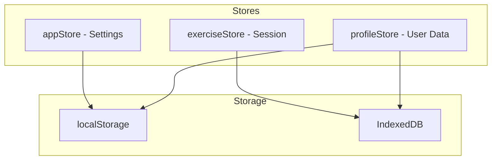

# Mini Trainer Engine - Refactoring Analysis

## Executive Summary

This document provides a comprehensive analysis of the mini-trainer-engine codebase, identifying refactoring opportunities to improve maintainability, reduce code duplication, and optimize context window requirements for AI-assisted development.

---

## 1. Current Architecture Overview

### 1.1 Project Structure

The codebase follows a well-organized architecture with clear separation between:

- **Core Engine** (`src/core/`) - Reusable engine code unchanged between trainers
- **Configuration** (`src/config/`) - Trainer-specific configuration files
- **Types** (`src/types/`) - TypeScript type definitions

### 1.2 Key Technologies

- **React 18** with TypeScript
- **Zustand** for state management with persistence middleware
- **React Router** for navigation
- **Tailwind CSS** for styling
- **IndexedDB** + **localStorage** for dual storage strategy

### 1.3 State Management



---

## 2. Identified Issues

### 2.1 Code Duplication - HIGH PRIORITY

#### Issue 2.1.1: Duplicate Shuffle Functions

**Location**:

- [`MatchingExercise.tsx`](../src/core/components/exercises/MatchingExercise.tsx:14-23)
- [`CategorySortExercise.tsx`](../src/core/components/exercises/CategorySortExercise.tsx:13-22)

**Problem**: Identical Fisher-Yates shuffle implementation duplicated.

**Impact**:

- Unnecessary code repetition
- Maintenance burden if algorithm needs changes
- Increases context window for AI

**Recommendation**: Extract to [`src/core/utils/shuffle.ts`](../src/core/utils/shuffle.ts) (already exists but not used).

---

#### Issue 2.1.2: Duplicate Star Calculation Logic

**Location**:

- [`useExerciseLogic.ts`](../src/core/hooks/useExerciseLogic.ts:13) - imports and re-exports
- [`useExerciseScoring.ts`](../src/core/hooks/useExerciseScoring.ts:160) - re-exports
- [`useGamification.ts`](../src/core/hooks/useGamification.ts:10-15) - imports
- [`gamification.ts`](../src/core/utils/gamification.ts:24-31) - source implementation

**Problem**: Multiple re-exports create confusion about the source of truth.

**Recommendation**: Single source in `gamification.ts`, remove re-exports from hooks.

---

#### Issue 2.1.3: Similar Exercise Component Patterns

**Location**: All exercise components in `src/core/components/exercises/`

**Common Patterns Duplicated**:

1. Solution state styling (green/red/gray color schemes)
2. HintButton integration
3. Check button with disabled state
4. Keyboard navigation setup

**Impact**: ~30-50 lines of similar code per exercise type.

---

### 2.2 Large Files Requiring Decomposition - HIGH PRIORITY

#### Issue 2.2.1: ExercisePage.tsx (22,681 chars)

**Location**: [`src/pages/ExercisePage.tsx`](../src/pages/ExercisePage.tsx)

**Problems**:

- Mixes session management, gamification, and UI rendering
- Contains duplicate logic with `useExerciseSession` hook
- Large useEffect blocks for session lifecycle

**Recommendation**:

- Extract session logic to `useExerciseSession` hook (already exists but not fully utilized)
- Create separate components for exercise header, footer, and feedback
- Move gamification processing to the hook

---

#### Issue 2.2.2: CategorySortExercise.tsx (21,255 chars)

**Location**: [`src/core/components/exercises/CategorySortExercise.tsx`](../src/core/components/exercises/CategorySortExercise.tsx)

**Problems**:

- Contains both drag-and-drop and touch handling logic
- Mixes state management with rendering
- Large touch event handlers inline

**Recommendation**:

- Extract drag-and-drop logic to `useCategorySort.ts` (already exists in sorting/ subfolder)
- Extract touch handlers to separate hook or utility
- Consider splitting into CategoryBucket, DraggableItem components (already exist)

---

#### Issue 2.2.3: profileStore.ts (17,722 chars)

**Location**: [`src/core/stores/profileStore.ts`](../src/core/stores/profileStore.ts)

**Problems**:

- Contains profile state, save game logic, and IndexedDB sync
- Mixes concerns of state management and persistence
- Large selectors section

**Recommendation**:

- Extract save game utilities to separate file (partially done)
- Consider splitting into profile store and save game manager
- Move selectors to separate `selectors.ts` file

---

#### Issue 2.2.4: gamification.ts (17,512 chars)

**Location**: [`src/core/utils/gamification.ts`](../src/core/utils/gamification.ts)

**Problems**:

- Contains star calculation, level calculation, streak logic, and badge checking
- Multiple unrelated concerns in one file

**Recommendation**:

- Split into `starCalculation.ts`, `levelCalculation.ts`, `streakManager.ts`
- Keep badge logic in separate `badges.ts` (already exists)

---

### 2.3 Hook Architecture Issues - MEDIUM PRIORITY

#### Issue 2.3.1: Overlapping Hook Responsibilities

**Problem**: `useExerciseSession` and `useGamification` have overlapping concerns.

**Location**:

- [`useExerciseSession.ts`](../src/core/hooks/useExerciseSession.ts:140-154) - handles gamification
- [`useGamification.ts`](../src/core/hooks/useGamification.ts:155-225) - also processes exercise completion

**Impact**: Confusion about which hook to use, potential for inconsistent state.

**Recommendation**:

- `useGamification` should only provide gamification state and actions
- `useExerciseSession` should orchestrate the flow
- Clear separation of concerns

---

#### Issue 2.3.2: Underutilized useExerciseLogic Hook

**Location**: [`src/core/hooks/useExerciseLogic.ts`](../src/core/hooks/useExerciseLogic.ts)

**Problem**: This hook provides specialized variants (`useTextInputExercise`, `useMultipleChoiceExercise`, `useOrderingExercise`) but they are not used by the actual exercise components.

**Impact**:

- Missed opportunity for code reuse
- Exercise components implement their own logic

**Recommendation**: Refactor exercise components to use these hooks, or remove the unused variants.

---

### 2.4 Missing Abstractions - MEDIUM PRIORITY

#### Issue 2.4.1: No Shared Exercise Styling System

**Problem**: Each exercise component implements its own solution/feedback styling.

**Current Pattern** (repeated in multiple files):

```tsx
let style = 'bg-white border-2 border-gray-200';
if (showSolution) {
    if (isCorrect) {
        style = 'bg-green-50 border-2 border-green-400';
    } else if (isSelected) {
        style = 'bg-red-50 border-2 border-red-400';
    }
}
```

**Recommendation**: Create `useExerciseStyles` hook or `getExerciseStyle` utility.

---

#### Issue 2.4.2: No Shared Keyboard Navigation Hook

**Problem**: Keyboard navigation patterns are duplicated across exercises.

**Location**:

- [`MultipleChoiceExercise.tsx`](../src/core/components/exercises/MultipleChoiceExercise.tsx:31-57)
- Similar patterns in other exercises

**Recommendation**: Create `useKeyboardNavigation` hook with configurable options.

---

#### Issue 2.4.3: No Common Feedback Component

**Problem**: Correct/incorrect feedback is implemented differently in each exercise.

**Recommendation**: Create `ExerciseFeedback` component with consistent styling and animations.

---

### 2.5 Context Window Optimization - MEDIUM PRIORITY

#### Issue 2.5.1: Large Type Definition Files

**Location**: [`src/types/`](../src/types/)

**Problem**: Type files are comprehensive but large, contributing to context window.

**Recommendation**:

- Keep types well-organized with clear sections
- Use JSDoc comments sparingly
- Consider generating type documentation separately

---

#### Issue 2.5.2: Re-export Pattern Overhead

**Location**: [`src/types/index.ts`](../src/types/index.ts)

**Problem**: Large re-export file adds to context without adding value.

**Recommendation**: Consider direct imports from specific type files when possible.

---

### 2.6 Inconsistent Patterns - LOW PRIORITY

#### Issue 2.6.1: Mixed State Update Patterns

**Problem**: Some components use store selectors, others use direct store access.

**Examples**:

- `useExerciseStore((s) => s.showSolution)` - selector pattern
- `useExerciseStore.getState().answer` - direct access pattern

**Recommendation**: Standardize on selector pattern for React components, direct access only in callbacks.

---

#### Issue 2.6.2: Inconsistent Import Organization

**Problem**: Import statements vary in organization across files.

**Recommendation**: Establish and enforce import order convention:

1. React imports
2. External libraries
3. Internal aliases (@/)
4. Relative imports

---

## 3. Recommended Refactoring Plan

### Phase 1: Quick Wins (Low Risk, High Impact)

| Task | Effort | Impact | Risk |
|------|--------|--------|------|
| Consolidate shuffle functions | Low | Medium | Low |
| Remove duplicate star calculation re-exports | Low | Medium | Low |
| Extract common exercise styles | Medium | High | Low |
| Create ExerciseFeedback component | Medium | High | Low |

### Phase 2: Structural Improvements

| Task | Effort | Impact | Risk |
|------|--------|--------|------|
| Refactor ExercisePage to use hooks fully | High | High | Medium |
| Split CategorySortExercise | Medium | High | Low |
| Decompose gamification.ts | Medium | Medium | Low |
| Create useKeyboardNavigation hook | Medium | High | Low |

### Phase 3: Architecture Refinement

| Task | Effort | Impact | Risk |
|------|--------|--------|------|
| Consolidate hook responsibilities | High | High | Medium |
| Split profileStore | High | Medium | Medium |
| Implement exercise component base class/pattern | High | High | Medium |

---

## 4. Proposed New Abstractions

### 4.1 Exercise Style Utility

```typescript
// src/core/utils/exerciseStyles.ts
export function getSolutionStyle(
  state: 'default' | 'selected' | 'correct' | 'incorrect' | 'disabled'
): string {
  const styles = {
    default: 'bg-white border-2 border-gray-200',
    selected: 'bg-primary/10 border-2 border-primary',
    correct: 'bg-green-50 border-2 border-green-400',
    incorrect: 'bg-red-50 border-2 border-red-400',
    disabled: 'bg-gray-50 border-2 border-gray-200 opacity-50',
  };
  return styles[state];
}
```

### 4.2 Keyboard Navigation Hook

```typescript
// src/core/hooks/useKeyboardNavigation.ts
export function useKeyboardNavigation(options: {
  items: unknown[];
  onSelect: (index: number) => void;
  onActivate?: (index: number) => void;
  cyclic?: boolean;
}) {
  // Implementation
}
```

### 4.3 Exercise Feedback Component

```typescript
// src/core/components/exercises/ExerciseFeedback.tsx
interface ExerciseFeedbackProps {
  correct: boolean;
  message?: string;
  show: boolean;
}

export function ExerciseFeedback({ correct, message, show }: ExerciseFeedbackProps) {
  // Consistent feedback rendering
}
```

---

## 5. Metrics and Success Criteria

### Before Refactoring

| Metric | Current Value |
|--------|---------------|
| Largest file (chars) | 22,681 (ExercisePage.tsx) |
| Duplicate shuffle implementations | 2 |
| Exercise component avg size | ~8,000 chars |
| Hook count | 6 |

### Target After Refactoring

| Metric | Target Value |
|--------|--------------|
| Largest file (chars) | < 10,000 |
| Duplicate shuffle implementations | 0 |
| Exercise component avg size | ~5,000 chars |
| Shared utilities created | 3+ |

---

## 6. Risk Assessment

### Low Risk Changes

- Extracting utilities (shuffle, styles)
- Creating new shared components
- Adding new hooks

### Medium Risk Changes

- Refactoring ExercisePage
- Splitting large stores
- Modifying hook responsibilities

### High Risk Changes

- Changing state management patterns
- Modifying IndexedDB sync logic
- Breaking changes to exercise component interfaces

---

## 7. Recommendations Summary

### Immediate Actions (Do First)

1. **Consolidate shuffle function** - Import from existing `shuffle.ts` utility
2. **Create exercise style utility** - Extract common styling patterns
3. **Create ExerciseFeedback component** - Unify feedback display

### Short-term Actions

1. **Refactor ExercisePage** - Move logic to hooks
2. **Split CategorySortExercise** - Use existing sub-components fully
3. **Create useKeyboardNavigation hook** - Reduce duplication

### Long-term Actions

1. **Consolidate hook architecture** - Clear separation of concerns
2. **Decompose large utility files** - Better organization
3. **Standardize patterns** - Consistency across codebase

---

## 8. Conclusion

The mini-trainer-engine codebase is well-architected overall, with clear separation between core engine and configuration. The main opportunities for improvement are:

1. **Reducing code duplication** in exercise components
2. **Decomposing large files** into smaller, focused modules
3. **Creating shared abstractions** for common patterns
4. **Consolidating hook responsibilities** for clearer architecture

These changes will improve maintainability, reduce context window requirements for AI-assisted development, and make the codebase more approachable for new contributors.
