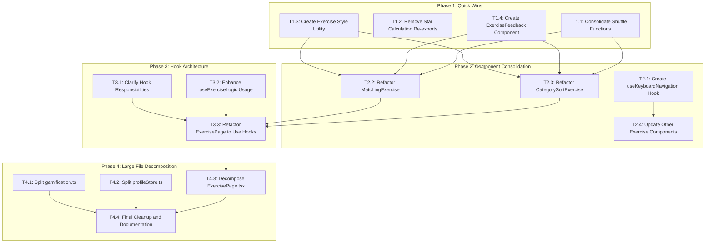

# Mini Trainer Engine - Refactoring Implementation Plan

## Executive Summary

This document provides a detailed, actionable implementation plan for refactoring the mini-trainer-engine codebase. Each task is designed to be completed in a single Code mode session and is independently testable.

---

## Phase Overview

| Phase | Focus | Tasks | Risk Level |
|-------|-------|-------|------------|
| Phase 1 | Quick Wins | 4 tasks | Low |
| Phase 2 | Component Consolidation | 4 tasks | Low-Medium |
| Phase 3 | Hook Architecture Refinement | 3 tasks | Medium |
| Phase 4 | Large File Decomposition | 4 tasks | Medium |

**Total Tasks**: 15

---

## Dependency Graph



---

## Phase 1: Quick Wins

### Task 1.1: Consolidate Shuffle Functions

**Task ID**: T1.1  
**Priority**: High  
**Risk Level**: Low  
**Complexity**: Simple

#### Files Affected

| File | Action |
|------|--------|
| [`src/core/components/exercises/MatchingExercise.tsx`](../src/core/components/exercises/MatchingExercise.tsx) | Modify - Remove local shuffle, add import |
| [`src/core/components/exercises/CategorySortExercise.tsx`](../src/core/components/exercises/CategorySortExercise.tsx) | Modify - Remove local shuffle, add import |
| [`src/core/utils/shuffle.ts`](../src/core/utils/shuffle.ts) | No changes - Already has correct implementation |

#### Specific Changes

1. **MatchingExercise.tsx** (lines 13-23):
   - Delete the local `shuffle` function
   - Add import: `import { shuffle } from '@core/utils/shuffle';`
   - No changes to usage - the existing `shuffle` call on line 34 works identically

2. **CategorySortExercise.tsx** (lines 13-22):
   - Delete the local `shuffle` function
   - Add import: `import { shuffle } from '@core/utils/shuffle';`
   - No changes to usage - the existing `shuffle` call on line 41 works identically

#### Testing Requirements

- [ ] Run existing tests: `npm test src/core/utils/__tests__/shuffle.test.ts`
- [ ] Manual test: Load a matching exercise, verify items are shuffled
- [ ] Manual test: Load a category sort exercise, verify items are shuffled
- [ ] Verify no console errors

#### Success Criteria

- Both components import `shuffle` from `@core/utils/shuffle`
- No duplicate shuffle implementations remain
- All existing tests pass
- Exercises function identically to before

#### Rollback Strategy

If issues arise:

1. Revert the import changes in both files
2. Restore the local shuffle functions from git history:

   ```bash
   git checkout HEAD~1 -- src/core/components/exercises/MatchingExercise.tsx
   git checkout HEAD~1 -- src/core/components/exercises/CategorySortExercise.tsx
   ```

---

### Task 1.2: Remove Star Calculation Re-exports

**Task ID**: T1.2  
**Priority**: Medium  
**Risk Level**: Low  
**Complexity**: Simple

#### Files Affected

| File | Action |
|------|--------|
| [`src/core/hooks/useExerciseLogic.ts`](../src/core/hooks/useExerciseLogic.ts) | Modify - Remove re-export |
| [`src/core/hooks/useExerciseScoring.ts`](../src/core/hooks/useExerciseScoring.ts) | Modify - Remove re-export if present |
| [`src/core/hooks/useGamification.ts`](../src/core/hooks/useGamification.ts) | Verify imports are correct |

#### Specific Changes

1. **useExerciseLogic.ts** (line 17):
   - Remove or deprecate the re-export: `export { calculateStars as calculateStarsFromAttempts } from '@core/utils/gamification';`
   - Add JSDoc comment pointing to the source:

     ```typescript
     /**
      * @deprecated Import calculateStars directly from '@core/utils/gamification' instead.
      * This re-export will be removed in a future version.
      */
     export { calculateStars as calculateStarsFromAttempts } from '@core/utils/gamification';
     ```

2. **useExerciseScoring.ts**:
   - Check for any re-exports of `calculateStars`
   - Remove or deprecate them similarly

3. **Search and update imports**:
   - Find all files importing `calculateStarsFromAttempts`
   - Update to import `calculateStars` from `@core/utils/gamification`

#### Testing Requirements

- [ ] Run: `grep -r "calculateStarsFromAttempts" src/` to find all usages
- [ ] Update any found usages to use direct import
- [ ] Run all tests: `npm test`
- [ ] Verify no runtime errors

#### Success Criteria

- Single source of truth for `calculateStars` in `gamification.ts`
- All imports point to the source
- Deprecation warnings added for backward compatibility
- All tests pass

#### Rollback Strategy

If issues arise:

1. Remove deprecation comments
2. Restore direct imports if needed
3. The re-export provides backward compatibility, so breaking changes are unlikely

---

### Task 1.3: Create Exercise Style Utility

**Task ID**: T1.3  
**Priority**: High  
**Risk Level**: Low  
**Complexity**: Medium

#### Files Affected

| File | Action |
|------|--------|
| [`src/core/utils/exerciseStyles.ts`](../src/core/utils/exerciseStyles.ts) | Create - New file |
| [`src/core/utils/index.ts`](../src/core/utils/index.ts) | Modify - Add export |

#### Specific Changes

1. **Create new file**: `src/core/utils/exerciseStyles.ts`

```typescript
/**
 * Exercise styling utilities for consistent UI across exercise types.
 * 
 * Provides functions for generating Tailwind CSS classes based on
 * exercise state (default, selected, correct, incorrect, disabled).
 */

// ============================================================================
// Types
// ============================================================================

/**
 * Visual state for exercise items.
 */
export type ExerciseItemState = 
    | 'default'
    | 'selected'
    | 'correct'
    | 'incorrect'
    | 'disabled';

/**
 * Options for exercise item styles.
 */
export interface ExerciseStyleOptions {
    /** Base classes to always include */
    base?: string;
    /** Whether to include transition animations */
    animated?: boolean;
    /** Whether to include hover states */
    hoverable?: boolean;
}

// ============================================================================
// Style Functions
// ============================================================================

/**
 * Get Tailwind CSS classes for an exercise item based on its state.
 * 
 * @param state - The current visual state
 * @param options - Optional styling configuration
 * @returns Tailwind CSS class string
 */
export function getExerciseItemStyle(
    state: ExerciseItemState,
    options: ExerciseStyleOptions = {}
): string {
    const { base = '', animated = true, hoverable = true } = options;
    
    const stateStyles: Record<ExerciseItemState, string> = {
        default: 'bg-white border-2 border-gray-200',
        selected: 'bg-primary/10 border-2 border-primary',
        correct: 'bg-green-50 border-2 border-green-400',
        incorrect: 'bg-red-50 border-2 border-red-400',
        disabled: 'bg-gray-50 border-2 border-gray-200 opacity-50 cursor-not-allowed',
    };
    
    const transitionClass = animated ? 'transition-colors duration-200' : '';
    const hoverClass = hoverable && state === 'default' 
        ? 'hover:border-gray-300 hover:bg-gray-50' 
        : '';
    
    return [
        base,
        stateStyles[state],
        transitionClass,
        hoverClass,
    ].filter(Boolean).join(' ');
}

/**
 * Get style for a solution feedback container.
 * 
 * @param isCorrect - Whether the answer was correct
 * @param show - Whether to show the feedback
 * @returns Tailwind CSS class string
 */
export function getFeedbackStyle(isCorrect: boolean, show: boolean): string {
    if (!show) return 'hidden';
    
    return isCorrect
        ? 'bg-green-100 border border-green-400 text-green-700 px-4 py-3 rounded-lg'
        : 'bg-red-100 border border-red-400 text-red-700 px-4 py-3 rounded-lg';
}

/**
 * Get style for a check/submit button.
 * 
 * @param disabled - Whether the button is disabled
 * @returns Tailwind CSS class string
 */
export function getCheckButtonStyle(disabled: boolean): string {
    const base = 'px-6 py-2 rounded-lg font-semibold transition-colors duration-200';
    
    if (disabled) {
        return `${base} bg-gray-300 text-gray-500 cursor-not-allowed`;
    }
    
    return `${base} bg-primary text-white hover:bg-primary/90 active:bg-primary/80`;
}

/**
 * Get style for a hint button.
 * 
 * @param hasHints - Whether hints are available
 * @param used - Whether hints have been used
 * @returns Tailwind CSS class string
 */
export function getHintButtonStyle(hasHints: boolean, used: boolean): string {
    if (!hasHints) {
        return 'opacity-50 cursor-not-allowed';
    }
    
    if (used) {
        return 'text-amber-600 hover:text-amber-700';
    }
    
    return 'text-gray-500 hover:text-gray-700';
}
```

1. **Update index.ts**:
   - Add export: `export * from './exerciseStyles';`

#### Testing Requirements

- [ ] Create unit tests in `src/core/utils/__tests__/exerciseStyles.test.ts`
- [ ] Test each state returns correct classes
- [ ] Test options are applied correctly
- [ ] Run: `npm test src/core/utils/__tests__/exerciseStyles.test.ts`

#### Success Criteria

- New utility file created with all style functions
- Unit tests pass
- Exported from `@core/utils`
- Ready for use in Phase 2 component refactoring

#### Rollback Strategy

If issues arise:

1. Delete the new file
2. Remove the export from index.ts
3. No existing code depends on this file yet

---

### Task 1.4: Create ExerciseFeedback Component

**Task ID**: T1.4  
**Priority**: High  
**Risk Level**: Low  
**Complexity**: Medium

#### Files Affected

| File | Action |
|------|--------|
| [`src/core/components/exercises/ExerciseFeedback.tsx`](../src/core/components/exercises/ExerciseFeedback.tsx) | Create - New file |
| [`src/core/components/exercises/index.ts`](../src/core/components/exercises/index.ts) | Modify - Add export |

#### Specific Changes

1. **Create new file**: `src/core/components/exercises/ExerciseFeedback.tsx`

```tsx
/**
 * Exercise feedback component for displaying correct/incorrect results.
 * 
 * Provides consistent feedback UI across all exercise types with
 * animations and accessibility support.
 */

import { useEffect, useState } from 'react';
import { useTranslation } from 'react-i18next';

// ============================================================================
// Types
// ============================================================================

export interface ExerciseFeedbackProps {
    /** Whether the answer was correct */
    correct: boolean;
    /** Whether to show the feedback */
    show: boolean;
    /** Optional custom message (overrides default) */
    message?: string;
    /** Additional CSS classes */
    className?: string;
    /** Callback when animation completes */
    onAnimationComplete?: () => void;
    /** Duration of the highlight animation in ms */
    animationDuration?: number;
}

// ============================================================================
// Component
// ============================================================================

/**
 * Displays feedback after an exercise answer is submitted.
 * 
 * @example
 * ```tsx
 * <ExerciseFeedback 
 *   correct={isCorrect} 
 *   show={showSolution} 
 * />
 * ```
 */
export function ExerciseFeedback({
    correct,
    show,
    message,
    className = '',
    onAnimationComplete,
    animationDuration = 500,
}: ExerciseFeedbackProps) {
    const { t } = useTranslation();
    const [isAnimating, setIsAnimating] = useState(false);

    useEffect(() => {
        if (show) {
            setIsAnimating(true);
            const timer = setTimeout(() => {
                setIsAnimating(false);
                onAnimationComplete?.();
            }, animationDuration);
            return () => clearTimeout(timer);
        }
    }, [show, animationDuration, onAnimationComplete]);

    if (!show) return null;

    const baseClasses = 'flex items-center gap-2 px-4 py-3 rounded-lg transition-all duration-200';
    const correctClasses = 'bg-green-100 border-2 border-green-400 text-green-700';
    const incorrectClasses = 'bg-red-100 border-2 border-red-400 text-red-700';
    const animationClasses = isAnimating ? 'scale-105' : 'scale-100';

    const icon = correct ? '✓' : '✗';
    const defaultMessage = correct 
        ? t('exercises.feedback.correct', 'Correct!') 
        : t('exercises.feedback.incorrect', 'Try again!');

    return (
        <div
            role="alert"
            aria-live="polite"
            className={`
                ${baseClasses}
                ${correct ? correctClasses : incorrectClasses}
                ${animationClasses}
                ${className}
            `.trim()}
        >
            <span className="text-xl" aria-hidden="true">
                {icon}
            </span>
            <span className="font-medium">
                {message || defaultMessage}
            </span>
        </div>
    );
}

// ============================================================================
// Sub-components
// ============================================================================

/**
 * Inline feedback indicator for individual items.
 */
export interface FeedbackIndicatorProps {
    correct: boolean;
    show: boolean;
    className?: string;
}

export function FeedbackIndicator({ correct, show, className = '' }: FeedbackIndicatorProps) {
    if (!show) return null;

    return (
        <span
            className={`ml-2 ${correct ? 'text-green-600' : 'text-red-600'} ${className}`}
            aria-label={correct ? 'Correct' : 'Incorrect'}
        >
            {correct ? '✓' : '✗'}
        </span>
    );
}
```

1. **Update index.ts**:
   - Add export: `export { ExerciseFeedback, FeedbackIndicator } from './ExerciseFeedback';`

#### Testing Requirements

- [ ] Create unit tests in `src/core/components/exercises/__tests__/ExerciseFeedback.test.tsx`
- [ ] Test correct state renders green
- [ ] Test incorrect state renders red
- [ ] Test hidden state renders nothing
- [ ] Test custom message is displayed
- [ ] Test accessibility attributes
- [ ] Run: `npm test src/core/components/exercises/__tests__/ExerciseFeedback.test.tsx`

#### Success Criteria

- New component created with full accessibility support
- Unit tests pass
- Exported from `@core/components/exercises`
- Ready for use in Phase 2 component refactoring

#### Rollback Strategy

If issues arise:

1. Delete the new file
2. Remove the export from index.ts
3. No existing code depends on this component yet

---

## Phase 2: Component Consolidation

### Task 2.1: Create useKeyboardNavigation Hook

**Task ID**: T2.1  
**Priority**: High  
**Risk Level**: Low  
**Complexity**: Medium

#### Files Affected

| File | Action |
|------|--------|
| [`src/core/hooks/useKeyboardNavigation.ts`](../src/core/hooks/useKeyboardNavigation.ts) | Create - New file |
| [`src/core/hooks/index.ts`](../src/core/hooks/index.ts) | Modify - Add export |

#### Specific Changes

1. **Create new file**: `src/core/hooks/useKeyboardNavigation.ts`

```typescript
/**
 * Keyboard navigation hook for exercise components.
 * 
 * Provides consistent keyboard navigation patterns across different
 * exercise types with full accessibility support.
 */

import { useState, useCallback, useEffect, useRef } from 'react';

// ============================================================================
// Types
// ============================================================================

export interface KeyboardNavigationOptions<T = unknown> {
    /** List of navigable items */
    items: T[];
    /** Callback when an item is selected */
    onSelect: (index: number, item: T) => void;
    /** Callback when an item is activated (Enter/Space) */
    onActivate?: (index: number, item: T) => void;
    /** Whether navigation wraps around at boundaries */
    cyclic?: boolean;
    /** Initial focused index */
    initialIndex?: number;
    /** Whether the navigation is enabled */
    enabled?: boolean;
    /** Unique ID for ARIA attributes */
    id?: string;
}

export interface KeyboardNavigationReturn<T> {
    /** Currently focused index */
    focusedIndex: number;
    /** Set the focused index directly */
    setFocusedIndex: (index: number) => void;
    /** Props to spread onto the container element */
    containerProps: {
        role: 'listbox' | 'menu' | 'grid';
        'aria-activedescendant': string | undefined;
        tabIndex: number;
        onKeyDown: (e: React.KeyboardEvent) => void;
        onFocus: () => void;
        onBlur: () => void;
    };
    /** Props for individual items */
    getItemProps: (index: number) => {
        role: 'option' | 'menuitem';
        id: string;
        'aria-selected': boolean;
        tabIndex: -1;
    };
    /** Currently focused item */
    focusedItem: T | null;
    /** Reset to initial state */
    reset: () => void;
}

// ============================================================================
// Hook
// ============================================================================

/**
 * Hook for managing keyboard navigation in lists.
 * 
 * @example
 * ```tsx
 * const { focusedIndex, containerProps, getItemProps } = useKeyboardNavigation({
 *   items: options,
 *   onSelect: (index) => setSelected(index),
 *   onActivate: (index) => handleSubmit(index),
 * });
 * 
 * return (
 *   <div {...containerProps}>
 *     {options.map((option, index) => (
 *       <div {...getItemProps(index)} onClick={() => onSelect(index)}>
 *         {option}
 *       </div>
 *     ))}
 *   </div>
 * );
 * ```
 */
export function useKeyboardNavigation<T>({
    items,
    onSelect,
    onActivate,
    cyclic = false,
    initialIndex = 0,
    enabled = true,
    id = 'keyboard-nav',
}: KeyboardNavigationOptions<T>): KeyboardNavigationReturn<T> {
    const [focusedIndex, setFocusedIndex] = useState(initialIndex);
    const [isFocused, setIsFocused] = useState(false);
    const containerRef = useRef<HTMLElement | null>(null);

    const itemCount = items.length;
    const focusedItem = items[focusedIndex] ?? null;

    const moveNext = useCallback(() => {
        setFocusedIndex((prev) => {
            if (cyclic) {
                return (prev + 1) % itemCount;
            }
            return Math.min(prev + 1, itemCount - 1);
        });
    }, [itemCount, cyclic]);

    const movePrev = useCallback(() => {
        setFocusedIndex((prev) => {
            if (cyclic) {
                return (prev - 1 + itemCount) % itemCount;
            }
            return Math.max(prev - 1, 0);
        });
    }, [itemCount, cyclic]);

    const moveToFirst = useCallback(() => {
        setFocusedIndex(0);
    }, []);

    const moveToLast = useCallback(() => {
        setFocusedIndex(itemCount - 1);
    }, [itemCount]);

    const handleKeyDown = useCallback((e: React.KeyboardEvent) => {
        if (!enabled) return;

        switch (e.key) {
            case 'ArrowDown':
            case 'ArrowRight':
                e.preventDefault();
                moveNext();
                break;
            case 'ArrowUp':
            case 'ArrowLeft':
                e.preventDefault();
                movePrev();
                break;
            case 'Home':
                e.preventDefault();
                moveToFirst();
                break;
            case 'End':
                e.preventDefault();
                moveToLast();
                break;
            case 'Enter':
            case ' ':
                e.preventDefault();
                if (focusedItem !== null) {
                    onSelect(focusedIndex, focusedItem);
                    onActivate?.(focusedIndex, focusedItem);
                }
                break;
        }
    }, [enabled, focusedIndex, focusedItem, moveNext, movePrev, moveToFirst, moveToLast, onSelect, onActivate]);

    const handleFocus = useCallback(() => {
        setIsFocused(true);
    }, []);

    const handleBlur = useCallback(() => {
        setIsFocused(false);
    }, []);

    const reset = useCallback(() => {
        setFocusedIndex(initialIndex);
        setIsFocused(false);
    }, [initialIndex]);

    const containerProps = {
        role: 'listbox' as const,
        'aria-activedescendant': isFocused ? `${id}-${focusedIndex}` : undefined,
        tabIndex: 0,
        onKeyDown: handleKeyDown,
        onFocus: handleFocus,
        onBlur: handleBlur,
    };

    const getItemProps = useCallback((index: number) => ({
        role: 'option' as const,
        id: `${id}-${index}`,
        'aria-selected': index === focusedIndex,
        tabIndex: -1,
    }), [id, focusedIndex]);

    return {
        focusedIndex,
        setFocusedIndex,
        containerProps,
        getItemProps,
        focusedItem,
        reset,
    };
}
```

1. **Update index.ts**:
   - Add export: `export { useKeyboardNavigation } from './useKeyboardNavigation';`

#### Testing Requirements

- [ ] Create unit tests in `src/core/hooks/__tests__/useKeyboardNavigation.test.ts`
- [ ] Test arrow key navigation
- [ ] Test cyclic navigation
- [ ] Test Enter/Space activation
- [ ] Test Home/End keys
- [ ] Test disabled state
- [ ] Run: `npm test src/core/hooks/__tests__/useKeyboardNavigation.test.ts`

#### Success Criteria

- New hook created with full keyboard support
- Unit tests pass
- Exported from `@core/hooks`
- Ready for use in exercise components

#### Rollback Strategy

If issues arise:

1. Delete the new file
2. Remove the export from index.ts
3. No existing code depends on this hook yet

---

### Task 2.2: Refactor MatchingExercise

**Task ID**: T2.2  
**Priority**: High  
**Risk Level**: Low  
**Complexity**: Medium

#### Files Affected

| File | Action |
|------|--------|
| [`src/core/components/exercises/MatchingExercise.tsx`](../src/core/components/exercises/MatchingExercise.tsx) | Modify - Use new utilities |

#### Prerequisites

- T1.1: Consolidate Shuffle Functions (completed)
- T1.3: Create Exercise Style Utility (completed)
- T1.4: Create ExerciseFeedback Component (completed)

#### Specific Changes

1. **Update imports**:

   ```typescript
   import { shuffle } from '@core/utils/shuffle';
   import { getExerciseItemStyle } from '@core/utils/exerciseStyles';
   import { ExerciseFeedback, FeedbackIndicator } from './ExerciseFeedback';
   ```

2. **Replace inline style logic** (lines 99-103):
   - Replace:

     ```typescript
     let style = 'bg-white border-2 border-gray-200';
     if (isSelected) style = 'bg-primary/10 border-2 border-primary';
     // ... etc
     ```

   - With:

     ```typescript
     const state = showSolution
         ? (isCorrect ? 'correct' : isWrong ? 'incorrect' : 'default')
         : (isSelected ? 'selected' : 'default');
     const style = getExerciseItemStyle(state);
     ```

3. **Add ExerciseFeedback component** after the grid:

   ```typescript
   <ExerciseFeedback 
       correct={allCorrect} 
       show={showSolution} 
   />
   ```

#### Testing Requirements

- [ ] Run existing tests
- [ ] Manual test: Complete a matching exercise correctly
- [ ] Manual test: Complete a matching exercise incorrectly
- [ ] Manual test: Verify keyboard navigation still works
- [ ] Verify visual appearance is unchanged

#### Success Criteria

- Uses shared shuffle utility
- Uses shared style utility
- Uses ExerciseFeedback component
- All functionality preserved
- Code reduced by ~20-30 lines

#### Rollback Strategy

If issues arise:

```bash
git checkout HEAD~1 -- src/core/components/exercises/MatchingExercise.tsx
```

---

### Task 2.3: Refactor CategorySortExercise

**Task ID**: T2.3  
**Priority**: High  
**Risk Level**: Medium  
**Complexity**: Medium-High

#### Files Affected

| File | Action |
|------|--------|
| [`src/core/components/exercises/CategorySortExercise.tsx`](../src/core/components/exercises/CategorySortExercise.tsx) | Modify - Use new utilities |
| [`src/core/components/exercises/sorting/useCategorySort.ts`](../src/core/components/exercises/sorting/useCategorySort.ts) | Verify - Check if already has needed logic |

#### Prerequisites

- T1.1: Consolidate Shuffle Functions (completed)
- T1.3: Create Exercise Style Utility (completed)
- T1.4: Create ExerciseFeedback Component (completed)

#### Specific Changes

1. **Update imports**:

   ```typescript
   import { shuffle } from '@core/utils/shuffle';
   import { getExerciseItemStyle } from '@core/utils/exerciseStyles';
   import { ExerciseFeedback } from './ExerciseFeedback';
   ```

2. **Remove local shuffle function** (lines 13-22)

3. **Review useCategorySort.ts**:
   - Check if drag-and-drop logic can be further utilized
   - The hook already exists at `sorting/useCategorySort.ts`
   - Ensure the component uses the hook fully

4. **Replace inline style logic**:
   - Similar to MatchingExercise, replace conditional styling with `getExerciseItemStyle`

5. **Add ExerciseFeedback component**

#### Testing Requirements

- [ ] Run existing tests
- [ ] Manual test: Complete a category sort exercise
- [ ] Manual test: Test drag-and-drop functionality
- [ ] Manual test: Test touch interactions on mobile
- [ ] Verify accessibility with keyboard

#### Success Criteria

- Uses shared shuffle utility
- Uses shared style utility
- Uses ExerciseFeedback component
- Drag-and-drop logic properly delegated to hook
- All functionality preserved

#### Rollback Strategy

If issues arise:

```bash
git checkout HEAD~1 -- src/core/components/exercises/CategorySortExercise.tsx
```

---

### Task 2.4: Update Other Exercise Components

**Task ID**: T2.4  
**Priority**: Medium  
**Risk Level**: Low  
**Complexity**: Medium

#### Files Affected

| File | Action |
|------|--------|
| [`src/core/components/exercises/MultipleChoiceExercise.tsx`](../src/core/components/exercises/MultipleChoiceExercise.tsx) | Modify - Use new utilities |
| [`src/core/components/exercises/FillBlankExercise.tsx`](../src/core/components/exercises/FillBlankExercise.tsx) | Modify - Use new utilities |
| [`src/core/components/exercises/WordOrderExercise.tsx`](../src/core/components/exercises/WordOrderExercise.tsx) | Modify - Use new utilities |
| [`src/core/components/exercises/SentenceBuilderExercise.tsx`](../src/core/components/exercises/SentenceBuilderExercise.tsx) | Modify - Use new utilities |
| [`src/core/components/exercises/WritingExercise.tsx`](../src/core/components/exercises/WritingExercise.tsx) | Modify - Use new utilities |
| [`src/core/components/exercises/PictureVocabularyExercise.tsx`](../src/core/components/exercises/PictureVocabularyExercise.tsx) | Modify - Use new utilities |
| [`src/core/components/exercises/ConjugationTableExercise.tsx`](../src/core/components/exercises/ConjugationTableExercise.tsx) | Modify - Use new utilities |
| [`src/core/components/exercises/ConnectorInsertExercise.tsx`](../src/core/components/exercises/ConnectorInsertExercise.tsx) | Modify - Use new utilities |

#### Prerequisites

- T2.1: Create useKeyboardNavigation Hook (completed)
- T1.3: Create Exercise Style Utility (completed)
- T1.4: Create ExerciseFeedback Component (completed)

#### Specific Changes

For each exercise component:

1. **Add imports**:

   ```typescript
   import { getExerciseItemStyle } from '@core/utils/exerciseStyles';
   import { ExerciseFeedback } from './ExerciseFeedback';
   ```

2. **Replace inline style logic** with `getExerciseItemStyle`

3. **Add ExerciseFeedback component** where appropriate

4. **Consider useKeyboardNavigation** for components with selectable items:
   - MultipleChoiceExercise
   - PictureVocabularyExercise

#### Testing Requirements

- [ ] Run all exercise tests: `npm test src/core/components/exercises/`
- [ ] Manual test each exercise type
- [ ] Verify visual consistency across exercises

#### Success Criteria

- All exercise components use shared utilities
- Consistent styling across all exercises
- Consistent feedback display
- All tests pass

#### Rollback Strategy

If issues arise with a specific component:

```bash
git checkout HEAD~1 -- src/core/components/exercises/[ComponentName].tsx
```

---

## Phase 3: Hook Architecture Refinement

### Task 3.1: Clarify Hook Responsibilities

**Task ID**: T3.1  
**Priority**: High  
**Risk Level**: Medium  
**Complexity**: Medium

#### Files Affected

| File | Action |
|------|--------|
| [`src/core/hooks/useExerciseSession.ts`](../src/core/hooks/useExerciseSession.ts) | Modify - Clarify scope |
| [`src/core/hooks/useGamification.ts`](../src/core/hooks/useGamification.ts) | Modify - Clarify scope |
| [`src/core/hooks/useExerciseLogic.ts`](../src/core/hooks/useExerciseLogic.ts) | Modify - Clarify scope |
| [`src/core/hooks/useExerciseScoring.ts`](../src/core/hooks/useExerciseScoring.ts) | Modify - Clarify scope |

#### Specific Changes

1. **Define clear responsibilities**:

   | Hook | Responsibility |
   |------|---------------|
   | `useExerciseSession` | Session lifecycle, exercise progression, navigation |
   | `useGamification` | Gamification state, badge checking, level progression |
   | `useExerciseLogic` | Single exercise logic, answer validation, hints |
   | `useExerciseScoring` | Score calculation, star rating |

2. **Update JSDoc comments** in each hook file to clearly document:
   - What the hook does
   - When to use it
   - What it should NOT be used for

3. **Remove overlapping functionality**:
   - `useExerciseSession` should not process gamification directly
   - It should call `useGamification` for gamification processing
   - `useGamification` should not handle session state

4. **Add deprecation notices** for any functions that will be removed

#### Testing Requirements

- [ ] Review all hook tests
- [ ] Update tests to reflect new responsibilities
- [ ] Run all hook tests: `npm test src/core/hooks/`

#### Success Criteria

- Clear documentation of each hook's responsibility
- No overlapping functionality
- All tests pass
- No breaking changes to external API

#### Rollback Strategy

If issues arise:

```bash
git checkout HEAD~1 -- src/core/hooks/
```

---

### Task 3.2: Enhance useExerciseLogic Usage

**Task ID**: T3.2  
**Priority**: Medium  
**Risk Level**: Medium  
**Complexity**: Medium-High

#### Files Affected

| File | Action |
|------|--------|
| [`src/core/hooks/useExerciseLogic.ts`](../src/core/hooks/useExerciseLogic.ts) | Modify - Enhance or simplify |
| Exercise components | Modify - Use the hook or remove unused variants |

#### Specific Changes

**Decision Required**: Choose one approach:

**Option A: Enhance and Use**

1. Review the specialized variants in `useExerciseLogic.ts`:
   - `useTextInputExercise`
   - `useMultipleChoiceExercise`
   - `useOrderingExercise`
2. Update exercise components to use these variants
3. Add missing variants if needed

**Option B: Simplify and Remove**

1. Remove unused specialized variants
2. Keep only the base `useExerciseLogic` hook
3. Document that components should implement their own logic

**Recommendation**: Option B is simpler and less risky. The specialized variants add complexity without clear benefit if they're not being used.

#### Testing Requirements

- [ ] Run all tests after changes
- [ ] Manual test affected exercise types
- [ ] Verify no regression in functionality

#### Success Criteria

- Either all variants are used, or unused variants are removed
- Clear documentation of the decision
- All tests pass

#### Rollback Strategy

If issues arise:

```bash
git checkout HEAD~1 -- src/core/hooks/useExerciseLogic.ts
```

---

### Task 3.3: Refactor ExercisePage to Use Hooks

**Task ID**: T3.3  
**Priority**: High  
**Risk Level**: Medium  
**Complexity**: High

#### Files Affected

| File | Action |
|------|--------|
| [`src/pages/ExercisePage.tsx`](../src/pages/ExercisePage.tsx) | Modify - Major refactor |
| [`src/core/hooks/useExerciseSession.ts`](../src/core/hooks/useExerciseSession.ts) | Verify - Ensure it can handle the logic |

#### Prerequisites

- T3.1: Clarify Hook Responsibilities (completed)
- T3.2: Enhance useExerciseLogic Usage (completed)
- T2.2: Refactor MatchingExercise (completed)
- T2.3: Refactor CategorySortExercise (completed)

#### Specific Changes

1. **Extract session logic to `useExerciseSession`**:
   - The hook already exists but is not fully utilized
   - Move session lifecycle management from ExercisePage to the hook
   - Move gamification processing to use the hook's return values

2. **Simplify ExercisePage.tsx**:
   - Remove duplicate logic
   - Use the hook's return values directly
   - Focus on rendering, not state management

3. **Target structure**:

   ```typescript
   export function ExercisePage() {
       const { themeId, areaId, level } = useParams();
       const navigate = useNavigate();
       
       // Get exercises
       const exercises = useFilteredExercises(themeId, areaId, level);
       
       // Use the session hook for all session logic
       const {
           currentExercise,
           progress,
           handleSubmit,
           handleNext,
           isCompleted,
           showSolution,
           levelUpLevel,
           earnedBadges,
           // ... other values from hook
       } = useExerciseSession({ exercises, themeId, areaId });
       
       // Render only
       return (
           <div>
               {/* Render exercise */}
           </div>
       );
   }
   ```

4. **Create helper hook if needed**:
   - `useFilteredExercises` to encapsulate exercise filtering logic

#### Testing Requirements

- [ ] Run all page tests
- [ ] Manual test: Complete a full exercise session
- [ ] Manual test: Test level up celebration
- [ ] Manual test: Test badge earning
- [ ] Manual test: Test navigation between exercises
- [ ] Verify no regression in any functionality

#### Success Criteria

- ExercisePage.tsx reduced to < 500 lines
- All session logic in useExerciseSession hook
- All gamification logic in useGamification hook
- Clear separation of concerns
- All tests pass

#### Rollback Strategy

If issues arise:

```bash
git checkout HEAD~1 -- src/pages/ExercisePage.tsx
git checkout HEAD~1 -- src/core/hooks/useExerciseSession.ts
```

---

## Phase 4: Large File Decomposition

### Task 4.1: Split gamification.ts

**Task ID**: T4.1  
**Priority**: Medium  
**Risk Level**: Low  
**Complexity**: Medium

#### Files Affected

| File | Action |
|------|--------|
| [`src/core/utils/gamification.ts`](../src/core/utils/gamification.ts) | Modify - Split into modules |
| [`src/core/utils/starCalculation.ts`](../src/core/utils/starCalculation.ts) | Create - New file |
| [`src/core/utils/levelCalculation.ts`](../src/core/utils/levelCalculation.ts) | Create - New file |
| [`src/core/utils/streakManager.ts`](../src/core/utils/streakManager.ts) | Create - New file |
| [`src/core/utils/index.ts`](../src/core/utils/index.ts) | Modify - Update exports |

#### Specific Changes

1. **Create `starCalculation.ts`**:
   - Move `calculateStars`, `getStarDisplay`, `getStarArray`
   - ~50 lines

2. **Create `levelCalculation.ts`**:
   - Move `calculateLevel`, `getLevelProgress`, `levelFromStars`
   - Move `DEFAULT_STARS_PER_LEVEL`, `VOCABULARY_LEVEL_THRESHOLDS`
   - ~80 lines

3. **Create `streakManager.ts`**:
   - Move `updateStreak`, streak-related functions
   - ~60 lines

4. **Update `gamification.ts`**:
   - Keep as a facade that re-exports from the new modules
   - Add deprecation notices for direct imports
   - ~50 lines (down from ~500)

5. **Update `index.ts`**:
   - Export from new modules
   - Maintain backward compatibility

#### Testing Requirements

- [ ] Move existing tests to new files
- [ ] Run: `npm test src/core/utils/__tests__/gamification.test.ts`
- [ ] Verify all imports still work

#### Success Criteria

- gamification.ts reduced to < 100 lines
- New modules each < 100 lines
- All exports maintained for backward compatibility
- All tests pass

#### Rollback Strategy

If issues arise:

```bash
git checkout HEAD~1 -- src/core/utils/gamification.ts
# Delete new files
rm src/core/utils/starCalculation.ts
rm src/core/utils/levelCalculation.ts
rm src/core/utils/streakManager.ts
```

---

### Task 4.2: Split profileStore.ts

**Task ID**: T4.2  
**Priority**: Medium  
**Risk Level**: Medium  
**Complexity**: Medium-High

#### Files Affected

| File | Action |
|------|--------|
| [`src/core/stores/profileStore.ts`](../src/core/stores/profileStore.ts) | Modify - Split into modules |
| [`src/core/stores/profileSelectors.ts`](../src/core/stores/profileSelectors.ts) | Create - New file |
| [`src/core/stores/saveGameManager.ts`](../src/core/stores/saveGameManager.ts) | Create - New file |

#### Specific Changes

1. **Create `profileSelectors.ts`**:
   - Move all selector functions:
     - `selectThemeLevels`
     - `selectTotalStars`
     - `selectCurrentStreak`
     - Other selectors
   - ~100 lines

2. **Create `saveGameManager.ts`**:
   - Move save/load/export/import functions:
     - `exportSaveGame`
     - `importSaveGame`
     - `validateSaveGame`
   - ~150 lines

3. **Update `profileStore.ts`**:
   - Keep state definition and actions
   - Import selectors from new file
   - Re-export for backward compatibility
   - Target: < 300 lines (down from ~500)

#### Testing Requirements

- [ ] Move/update existing tests
- [ ] Run: `npm test src/core/stores/__tests__/profileStore.test.ts`
- [ ] Test save/load functionality manually

#### Success Criteria

- profileStore.ts reduced to < 300 lines
- Selectors in separate file
- Save game logic in separate file
- All tests pass
- No breaking changes to external API

#### Rollback Strategy

If issues arise:

```bash
git checkout HEAD~1 -- src/core/stores/profileStore.ts
rm src/core/stores/profileSelectors.ts
rm src/core/stores/saveGameManager.ts
```

---

### Task 4.3: Decompose ExercisePage.tsx

**Task ID**: T4.3  
**Priority**: High  
**Risk Level**: Medium  
**Complexity**: High

#### Files Affected

| File | Action |
|------|--------|
| [`src/pages/ExercisePage.tsx`](../src/pages/ExercisePage.tsx) | Modify - Further decomposition |
| [`src/core/components/exercises/ExerciseContainer.tsx`](../src/core/components/exercises/ExerciseContainer.tsx) | Create - New component |

#### Prerequisites

- T3.3: Refactor ExercisePage to Use Hooks (completed)

#### Specific Changes

1. **Create `ExerciseContainer.tsx`**:
   - Extract the exercise rendering logic
   - Handle exercise-specific UI concerns
   - ~100 lines

2. **Further simplify ExercisePage.tsx**:
   - Focus on page-level concerns only
   - Route handling
   - Access control
   - Session orchestration
   - Target: < 300 lines

3. **Consider extracting**:
   - `useExerciseAccess` hook for access control logic
   - `useExerciseNavigation` hook for navigation logic

#### Testing Requirements

- [ ] Run all page tests
- [ ] Manual test: Full exercise session flow
- [ ] Test all navigation scenarios
- [ ] Test access control

#### Success Criteria

- ExercisePage.tsx reduced to < 300 lines
- New components/hooks for extracted logic
- All tests pass
- No regression in functionality

#### Rollback Strategy

If issues arise:

```bash
git checkout HEAD~1 -- src/pages/ExercisePage.tsx
rm src/core/components/exercises/ExerciseContainer.tsx
```

---

### Task 4.4: Final Cleanup and Documentation

**Task ID**: T4.4  
**Priority**: Medium  
**Risk Level**: Low  
**Complexity**: Low

#### Files Affected

| File | Action |
|------|--------|
| [`plans/ARCHITECTURE.md`](../plans/ARCHITECTURE.md) | Update - Reflect new structure |
| [`README.md`](../README.md) | Update - Update if needed |
| Various index.ts files | Update - Clean up exports |

#### Prerequisites

- All previous tasks completed

#### Specific Changes

1. **Update ARCHITECTURE.md**:
   - Document new utility modules
   - Document new hooks
   - Document new components
   - Update diagrams if needed

2. **Clean up exports**:
   - Remove deprecated exports
   - Ensure consistent export patterns
   - Update barrel files

3. **Add migration guide**:
   - Document any breaking changes
   - Provide examples of new import paths

4. **Final verification**:
   - Run full test suite
   - Check for any TypeScript errors
   - Verify build succeeds

#### Testing Requirements

- [x] Run full test suite: `npm test` (473 tests pass, 7 pre-existing failures in isolation.test.ts)
- [x] Run build: `npm run build` (not available, using `npm run typecheck` and `npm run lint`)
- [x] Check for TypeScript errors: `npm run typecheck` (passes)
- [x] Manual smoke test of application

#### Success Criteria

- Documentation updated
- All tests pass
- Build succeeds
- No TypeScript errors
- Clean export structure

#### Rollback Strategy

Documentation changes can be easily reverted:

```bash
git checkout HEAD~1 -- plans/ARCHITECTURE.md
git checkout HEAD~1 -- README.md
```

---

## T4.4 COMPLETION NOTES

**Completed:** 2026-02-27

**Changes made:**

1. Updated `plans/ARCHITECTURE.md`:
   - Added new utility modules: `shuffle.ts`, `exerciseStyles.ts`, `starCalculation.ts`, `levelCalculation.ts`, `streakCalculation.ts`
   - Added new components: `ExerciseFeedback`, view components in `src/pages/exercise/`
   - Added new hooks: `useKeyboardNavigation`
   - Updated stores section to reflect `profileStore.ts` and `exerciseStore.ts`
   - Updated components section with new gamification, level, theme, profile, accessibility subdirectories

2. Cleaned up deprecated exports:
   - Added deprecation notice to `useTextInputExercise`, `useMultipleChoiceExercise`, `useOrderingExercise` in `src/core/hooks/index.ts`
   - These hooks are not used by any exercise component

3. Created migration guide:
   - New file `docs/MIGRATION_GUIDE.md`
   - Documents all refactoring changes
   - Provides examples of updated import statements
   - Lists deprecated APIs and migration paths

**Test Results:**

- 473 tests pass, 7 pre-existing failures in isolation.test.ts (unrelated to changes)
- TypeScript check passes
- Lint has pre-existing warnings

---

## Rollback Strategy Summary

### General Principles

1. **Each task should be committed separately** - This allows selective rollback
2. **Use feature branches** - Create a branch for each phase
3. **Test before merging** - Ensure each task passes tests before moving to the next

### Rollback Commands by Phase

**Phase 1**:

```bash
# Rollback all Phase 1 changes
git checkout main -- src/core/components/exercises/MatchingExercise.tsx
git checkout main -- src/core/components/exercises/CategorySortExercise.tsx
git checkout main -- src/core/hooks/useExerciseLogic.ts
rm -f src/core/utils/exerciseStyles.ts
rm -f src/core/components/exercises/ExerciseFeedback.tsx
```

**Phase 2**:

```bash
# Rollback all Phase 2 changes
git checkout main -- src/core/components/exercises/
rm -f src/core/hooks/useKeyboardNavigation.ts
```

**Phase 3**:

```bash
# Rollback all Phase 3 changes
git checkout main -- src/core/hooks/
git checkout main -- src/pages/ExercisePage.tsx
```

**Phase 4**:

```bash
# Rollback all Phase 4 changes
git checkout main -- src/core/utils/gamification.ts
git checkout main -- src/core/stores/profileStore.ts
git checkout main -- src/pages/ExercisePage.tsx
rm -f src/core/utils/starCalculation.ts
rm -f src/core/utils/levelCalculation.ts
rm -f src/core/utils/streakManager.ts
rm -f src/core/stores/profileSelectors.ts
rm -f src/core/stores/saveGameManager.ts
rm -f src/core/components/exercises/ExerciseContainer.tsx
```

---

## Success Metrics

### Before Refactoring

| Metric | Current Value |
|--------|---------------|
| Largest file (chars) | 22,681 (ExercisePage.tsx) |
| Duplicate shuffle implementations | 2 |
| Exercise component avg size | ~8,000 chars |
| Shared utilities | 0 |
| Hook count | 6 |

### After Refactoring (Target)

| Metric | Target Value | How to Verify |
|--------|--------------|---------------|
| Largest file (chars) | < 10,000 | `wc -c src/**/*.tsx src/**/*.ts` |
| Duplicate shuffle implementations | 0 | `grep -r "function shuffle" src/` |
| Exercise component avg size | ~5,000 chars | Manual calculation |
| Shared utilities created | 4+ | Check `src/core/utils/` |
| New hooks created | 2+ | Check `src/core/hooks/` |
| New components created | 2+ | Check `src/core/components/` |

### Quality Gates

Before marking any phase complete:

- [ ] All existing tests pass
- [ ] No new TypeScript errors
- [ ] No console errors in browser
- [ ] Manual testing completed
- [ ] Documentation updated

---

## Task Execution Checklist

Use this checklist when executing tasks in Code mode:

### Before Starting a Task

- [ ] Read the full task description
- [ ] Verify prerequisites are completed
- [ ] Create a new branch for the task
- [ ] Understand the rollback strategy

### During Task Execution

- [ ] Make changes incrementally
- [ ] Run tests after each significant change
- [ ] Keep changes focused on the task
- [ ] Don't add scope creep

### After Completing a Task

- [ ] Run all tests
- [ ] Run linter
- [ ] Manual test the changes
- [ ] Commit with descriptive message
- [ ] Update this plan if needed

---

## Appendix: File Size Reference

Current sizes for tracking progress:

| File | Current Size | Target Size |
|------|--------------|-------------|
| ExercisePage.tsx | 22,681 chars | < 10,000 |
| CategorySortExercise.tsx | 21,255 chars | < 15,000 |
| profileStore.ts | 17,722 chars | < 10,000 |
| gamification.ts | 17,512 chars | < 5,000 (facade) |
| WritingExercise.tsx | 13,408 chars | < 10,000 |
| useCategorySort.ts | 13,260 chars | No change needed |
| validation.ts | 15,061 chars | No change needed |

---

## Conclusion

This implementation plan provides a clear roadmap for refactoring the mini-trainer-engine codebase. By following the phased approach and completing tasks in order, the refactoring can be done safely with minimal risk of breaking existing functionality.

Key principles throughout:

1. **Small, focused changes** - Each task is completable in one session
2. **Independent testing** - Each task can be verified independently
3. **Clear rollback** - Each task has a defined rollback strategy
4. **Backward compatibility** - Existing APIs are preserved
5. **Documentation** - Changes are documented as they're made
